# OMÜ IoT Lab
IoT sensörlerden veya ilgili veri kaynaklarından veri toplayan, işleyen ve son kullanıcıya sunan uçtan uca bir labratuvar sistemi.

`!!! Bu doküman, bitirme projesi kapsamında geliştirdiğim sistemin kişisel teknik dokümantasyonudur. Ondokuz Mayıs Üniversitesi'nin resmî bir yayını değildir.!!!`

## Tanıtım

OMÜ IoT Laboratuvarı sistemi, sensörlerden toplanan ölçüm verisini
(sıcaklık, nem, ışık vb.) bir border router (Raspberry Pi Zero)
üzerinden ana sunucuya (Ubuntu) ileten, bu veriyi bir backend
(Spring Boot, Java) aracılığıyla NoSQL bir veritabanında (MongoDB)
kalıcı olarak saklayan ve bir web arayüzünde grafik/tablo hâlinde
kullanıcıya gösteren ölçeklenebilir bir sistemdir.

Sistem, dört bağımsız senaryo (tarım/bağ, rüzgar/liman, akarsu/sel,
Raspberry Pi canlı telemetri) üzerinden aynı mimari ile çalışır ve
`iotlab.omu.edu.tr` adresinde Dokku ile konteynerleştirilmiş bağımsız
servisler ve elle yapılandırılmış bir Nginx gateway üzerinden HTTPS
ile canlıya alınmıştır.

<p align="center">
  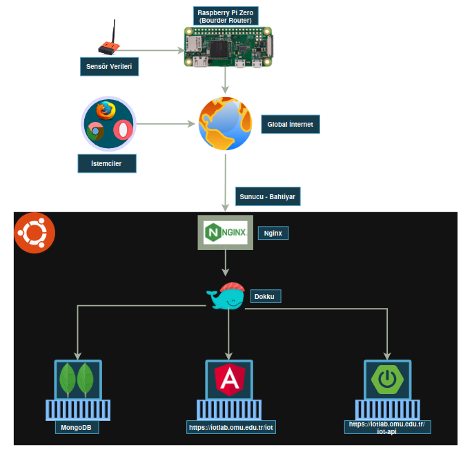
  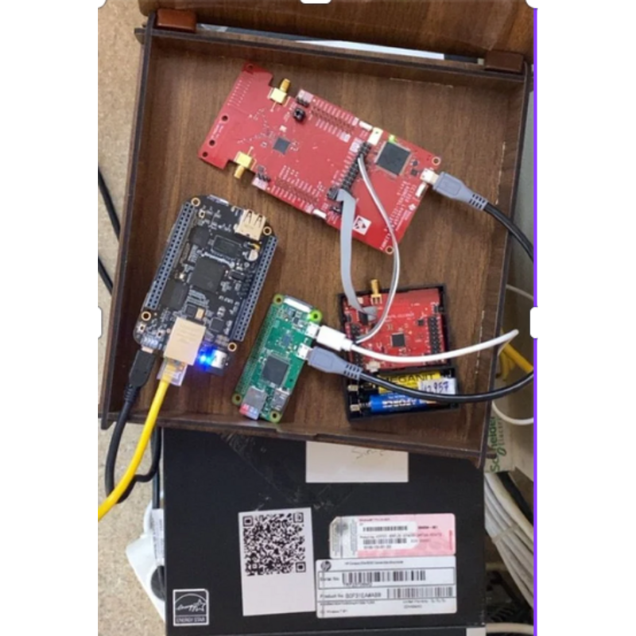
</p>

| | |
|---|---|
| **Proje adı** | OMÜ IoT Laboratuvarı için Sürdürülebilir ve Ölçeklenebilir Web Servislerinin Geliştirilmesi |
| **Nitelik** | Bilgisayar Mühendisliği Lisans Bitirme Projesi (Mayıs 2026) |
| **Yayındaki adres** | [iotlab.omu.edu.tr](https://iotlab.omu.edu.tr) |

### Proje Ekibi

| Ad | Görev | Bağlantılar |
|---|---|---|
| **Enes Kaan Afacan** | Sistem mimari tasarımı, sunucu ve border router yönetimi, dağıtım altyapısı, yazılım geliştirme, Nginx, Dokku, Linux, Spring Boot, Flask, Python, Certbot, Telegram API | [](https://github.com/eneskaanafacan) [](https://www.linkedin.com/in/enes-kaan-afacan-a60b32259/) |
| **Baran Ar** | Backend Developer, Ekip ve Proje Yönetimi, Java, Spring Boot, MongoDB, JWT, REST API, Yazılım Mimarisi (MVC) | [](https://github.com/baranar) [](https://www.linkedin.com/in/baranar/) |
| **Ayşegül Çemç** | Frontend Developer, Angular, Chart.js, Tailwind CSS, Responsive Tasarım, Figma/Canva, UI, HTML/CSS | []() [](https://www.linkedin.com/in/aysegulcemc/) |

## Örnek Görseller

<p align="center">
  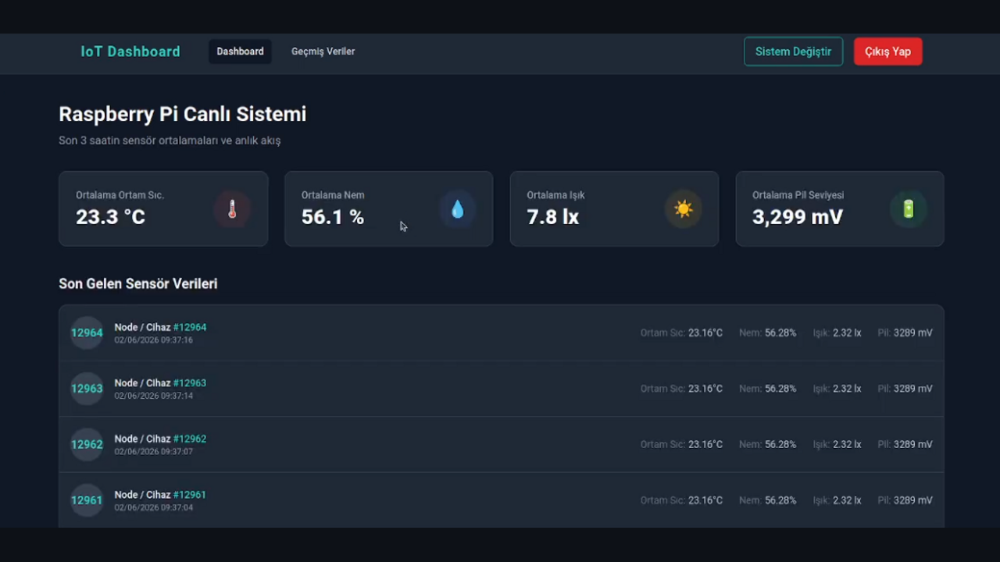
  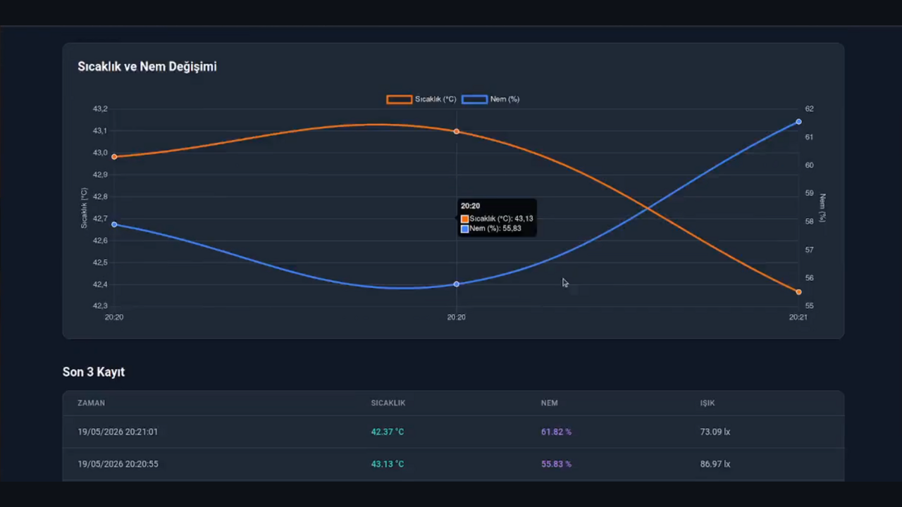
  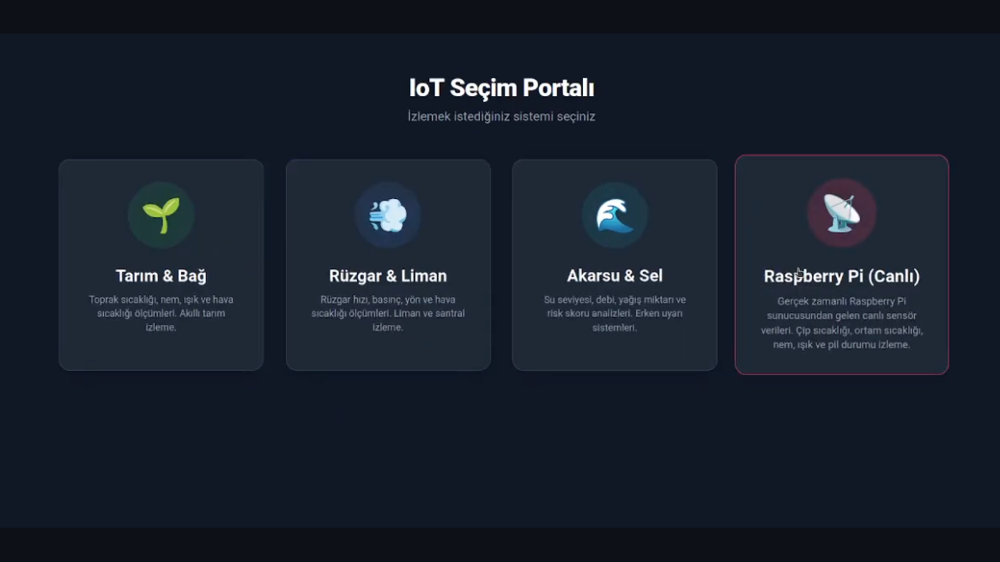
</p>

<p align="center">
  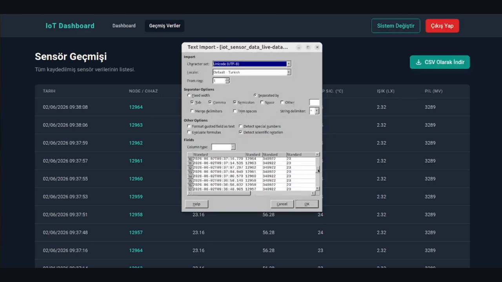
  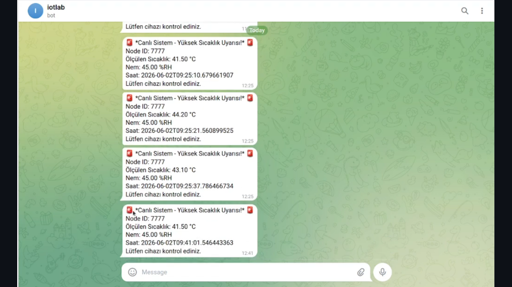
  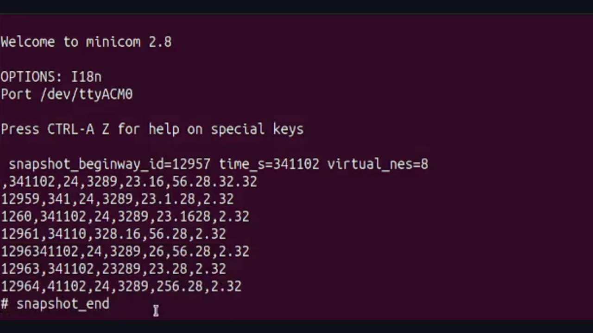
</p>

<p align="center">
  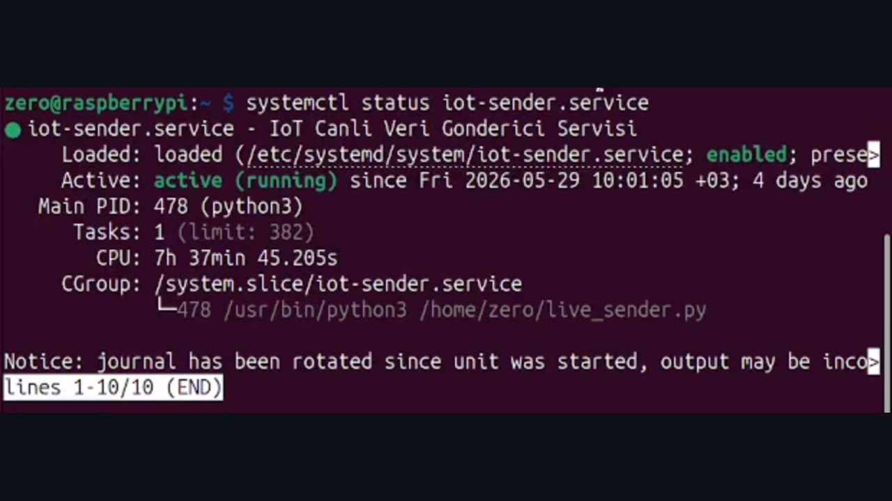
  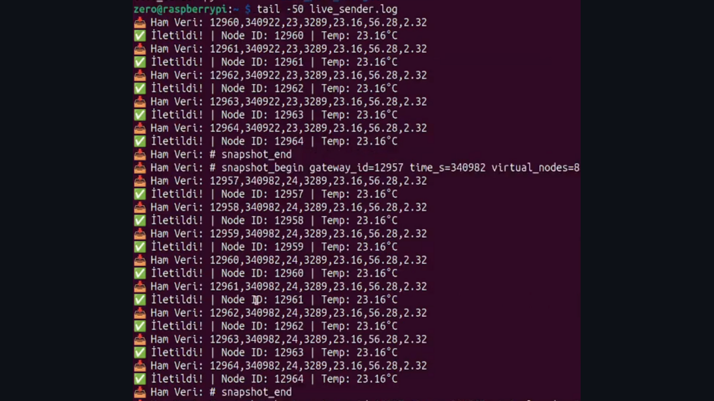
  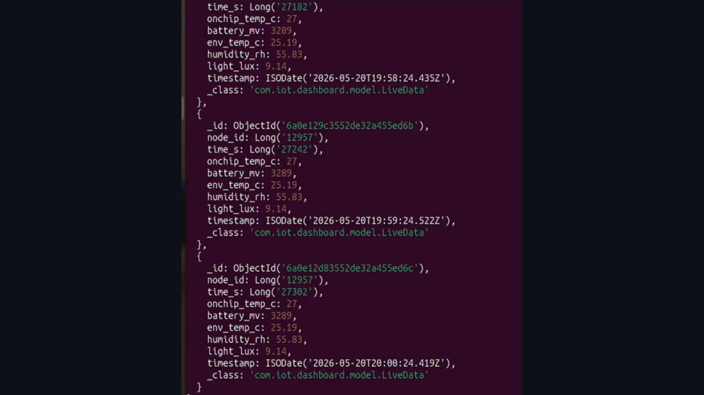
</p>

## Sisteme Kuş Bakışı Bir Bakış

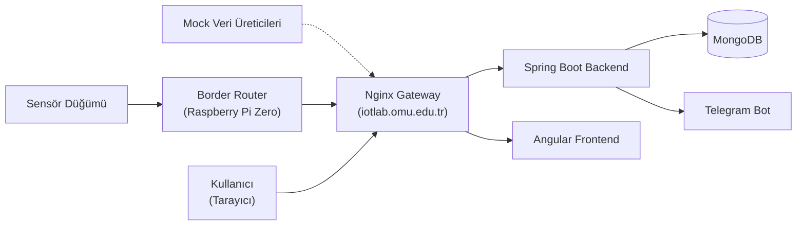

## Teknoloji Yığını

| Katman | Teknoloji |
|---|---|
| Backend | Java 17, Spring Boot 3.2.4, Spring Security 6, JWT |
| Veritabanı | MongoDB 8.0.12 |
| Frontend | Angular 17.3.12, Chart.js, Tailwind CSS |
| Border router | Python, Raspbian, Raspberry Pi Zero |
| Dağıtım / konteyner | Dokku (PaaS), Docker |
| Ters vekil | Nginx (elle yapılandırılmış) |
| Sunucu işletim sistemi | Ubuntu Server 24.04.2 LTS |
| Bildirim | Telegram Bot API |

## Öne Çıkan/İncelenmesini Önerdiğim Noktalar 

- Dökümanın omurgası niteliğinde sistem mimari yapısı (bkz. [03-system-architecture.md §6](docs/03-system-architecture.md#6-dört-sistem-tipi-ve-domain-agnostic-tasarım))
- Kamuya açık üniversite alan adı (`iotlab.omu.edu.tr`) üzerinden HTTPS ile yayın
- Tek alan adı altında path bazlı, elle yapılandırılmış çok uygulamalı bir Nginx gateway (bkz. [12-nginx-gateway.md](docs/12-nginx-gateway.md))
- Sıcaklık eşiği aşıldığında otomatik Telegram bildirimi (bkz. [07-backend.md §6](docs/07-backend.md#6-bildirim-servisi))
- Dokku tercihi (bkz. [11-dokku-paas.md](docs/11-dokku-paas.md))


## Dokümantasyon

| Doküman | Konu |
|---|---|
| **Genel** | |
| [01-overview.md](docs/01-overview.md) | Genel tanıtım, bileşen özeti, dokümantasyon rehberi |
| [02-requirements.md](docs/02-requirements.md) | Gereksinimler ve karşılanma durumu |
| [03-system-architecture.md](docs/03-system-architecture.md) | Uçtan uca mimari (omurga doküman) |
| **Donanım ve uç katman** | |
| [04-hardware-and-sensors.md](docs/04-hardware-and-sensors.md) | Sunucu, Raspberry Pi ve sensör donanımı |
| [05-border-router.md](docs/05-border-router.md) | Raspberry Pi üzerindeki seri okuma ve gönderim yazılımı |
| **Veri ve yazılım** | |
| [06-data-pipeline.md](docs/06-data-pipeline.md) | Veri hattı, gerçek/mock veri ayrımı |
| [07-backend.md](docs/07-backend.md) | Spring Boot backend iç mimarisi |
| [08-data-model.md](docs/08-data-model.md) | MongoDB koleksiyon şemaları |
| [09-frontend.md](docs/09-frontend.md) | Angular frontend iç mimarisi |
| **Altyapı ve işletim** | |
| [10-server-setup.md](docs/10-server-setup.md) | Ubuntu sunucu kurulumu |
| [11-dokku-paas.md](docs/11-dokku-paas.md) | Dokku PaaS |

## Geliştirme Süreci Hakkında

Sistemin tasarımı, geliştirilmesi, dağıtım
altyapısı ve mimari kararlar ekibimiz tarafından yürütülmüştür.
Yazılım geliştirme ve bu dokümantasyonun hazırlanması aşamalarında
yapay zekâ araçlarından yararlanılmıştır; üretilen içerik kaynak
kod, sunucu kayıtları ve proje raporuyla karşılaştırılarak
doğrulanmış ve tarafımızca gözden geçirilmiştir.

## Depo Yapısı

```
.
├── README.md              — bu dosya
├── backend/               — Spring Boot uygulaması (Java 17, MongoDB)
│   ├── pom.xml
│   ├── system.properties
│   └── src/main/
│       ├── java/com/iot/dashboard/
│       │   ├── config/        — açılışta çalışan yapılandırma bileşenleri
│       │   ├── controller/    — REST uçları (auth + dört sistem tipi)
│       │   ├── dto/           — istek/yanıt veri taşıyıcıları
│       │   ├── model/         — MongoDB doküman sınıfları
│       │   ├── repository/    — Spring Data MongoDB arayüzleri
│       │   ├── security/      — JWT filtresi, hız sınırlama, yetkilendirme
│       │   └── service/       — iş mantığı, eşik kontrolü, bildirim
│       └── resources/
│           └── application.properties
├── frontend/              — Angular 17 arayüzü
│   └── src/app/
│       ├── core/              — kimlik doğrulama servisi, guard, interceptor
│       ├── features/          — ekranlar (login, pano, geçmiş, node detay)
│       └── shared/            — ortak bileşenler
├── ekler/                 — sunucu ve uç katman dosyaları
│   ├── live_sender.py         — border router gönderim script'i
│   ├── iot-sender.service     — systemd servis tanımı
│   ├── iotlab_gateway.conf    — Nginx ters vekil yapılandırması
│   ├── backup-mongo.sh        — veritabanı yedekleme script'i
│   └── mongo-backup.cron      — yedekleme zamanlaması
└── docs/                  — teknik dokümantasyon
    ├── 01-overview.md          — genel bakış, problem tanımı, kapsam
    ├── 02-requirements.md      — fonksiyonel ve fonksiyonel olmayan gereksinimler
    ├── 03-system-architecture.md — uçtan uca mimari, katmanlar, port planı
    ├── 04-hardware-and-sensors.md — sensör düğümü, Raspberry Pi, ham veri biçimi
    ├── 05-border-router.md     — seri okuma, CSV→JSON dönüşümü, systemd servisi
    ├── 06-data-pipeline.md     — verinin uçtan uca izlediği dönüşüm zinciri
    ├── 07-backend.md           — Spring Boot iç mimarisi, controller/service katmanları
    ├── 08-data-model.md        — MongoDB koleksiyonları ve alan şemaları
    ├── 09-frontend.md          — Angular bileşenleri, rotalar, veri erişimi
    ├── 10-server-setup.md      — Ubuntu sunucunun kurulumu ve yönetimi
    ├── 11-dokku-paas.md        — Dokku ile dağıtım, konteyner yaşam döngüsü
    ├── 12-nginx-gateway.md     — path bazlı yönlendirme, ters vekil yapılandırması
    └── assets/                 — ekran görüntüleri ve diyagramlar
```


