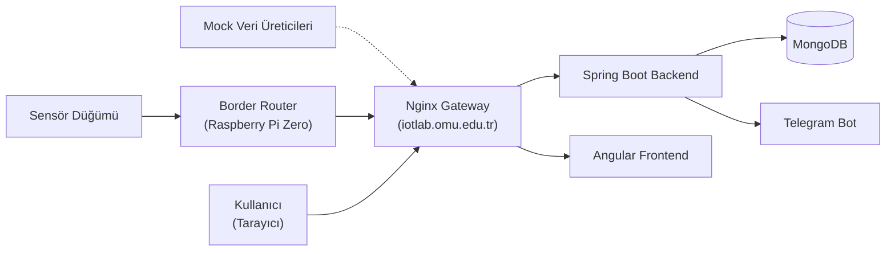

# Genel Bakış

Bu doküman, projenin tanıtım metnidir. Amacı, okuyucuya sistemi kısa şekilde anlatmak ve detay için ilgili dokümana yönlendirmektir. Bahsedilen her konu, ilgili dokümanda daha derinlemesine açıklanmıştır.

## OMU IoT Lab Nedir ?

OMÜ IoT Lab, sensörlerden toplanan çeşitli verileri bir Raspberry Pi Zero border router üzerinden merkezi bir Ubuntu sunucuya ileten, bu veriyi bir Spring Boot backend aracılığıyla MongoDB'de kalıcı olarak saklayan ve bir Angular web arayüzünde grafik/tablo hâlinde gösteren ölçeklenebilir bir sistemdir.
Sistem, aynı mimariyi tekrar kullanılabilir şekilde dört bağımsız
"sistem tipi" (tarım/bağ, rüzgar/liman, akarsu/sel, Raspberry Pi canlı
telemetri) üzerinden çalışır; bu dört sistemden yalnızca biri gerçek
bir fiziksel sensörden beslenir, diğer üçü mock veri üreticileriyle
simüle edilir (bkz. [§7](#gerçek-mi-simüle-mi)).
Sistem
`iotlab.omu.edu.tr` adresinde, Dokku ile konteynerleştirilmiş
servisler ve elle yapılandırılmış bir Nginx ters vekil sunucusu
üzerinden HTTPS ile çalışmaktadır.

## Problem ve Motivasyon

Ondokuz Mayıs Üniversitesi bünyesinde `iotlab.omu.edu.tr` adresinde
zaten yayında olan bir sayfa vardı, ama bu sayfa tek bir senaryoya özel
"kapalı kutu" bir yapıdaydı. Bu proje, mevcut IoT laboratuvar
sistemlerinin çoğunlukla belirli bir senaryoya özel tasarlanmış olması
ve her yeni araştırma projesi için altyapının sıfırdan kurulması
ihtiyacından doğdu.

Hedef, bu sayfayı "mekan bağımsız" ve ileride farklı IoT veya akademik projelere hizmet verebilecek, ölçeklenebilir bir sistem altyapısına dönüştürmekti

Ayrıntı: [02-requirements.md](02-requirements.md),
[03-system-architecture.md §1](03-system-architecture.md#1-amaç-ve-kapsam).

## Bileşenler — Kuşbakışı

1. **Fiziksel katman — sensör düğümü ve border router.** Bir
   mikrodenetleyici sıcaklık/nem/ışık ölçüp seri porta basıyor;
   Raspberry Pi Zero bu veriyi okuyup protokol dönüşümü (seri → HTTPS/
   JSON) yapıp sunucuya iletiyor. Ayrıntı:
   [04-hardware-and-sensors.md](04-hardware-and-sensors.md),
   [05-border-router.md](05-border-router.md).
2. **Ana sunucu ve dağıtım katmanı.** Tek bir Ubuntu Server 24.04.2
   LTS makinesi; Dokku ile konteynerleştirilmiş servisler, elle
   yazılmış bir Nginx gateway (path bazlı yönlendirme) ve HTTPS/TLS.
   Ayrıntı: [10-server-setup.md](10-server-setup.md),
   [11-dokku-paas.md](11-dokku-paas.md),
   [12-nginx-gateway.md](12-nginx-gateway.md),
   [13-tls-certificates.md](13-tls-certificates.md).
3. **Backend.** Spring Boot ile yazılmış, JWT ile korunan bir REST
   API; 4 sistem tipi için ayrı controller/service/repository
   dörtlüleri barındıran katmanlı bir monolit. Ayrıntı:
   [07-backend.md](07-backend.md).
4. **Veritabanı.** MongoDB, her sistem tipi için ayrı bir koleksiyon
   (`iot_data`, `live_data`, `wind_data`, `flood_data`) ve bir
   kullanıcı koleksiyonu (`users`). Ayrıntı:
   [08-data-model.md](08-data-model.md).
5. **Web arayüzü.** Angular ile yazılmış,
   JWT korumalı bir dashboard/geçmiş/node-detay arayüzü. Ayrıntı:
   [09-frontend.md](09-frontend.md).
6. **Bildirim.** Sıcaklık eşik değeri (`40.0 °C`) aşıldığında Telegram
   bot üzerinden otomatik uyarı. Ayrıntı:
   [07-backend.md §6](07-backend.md#6-bildirim-servisi).

## Basitleştirilmiş Mimari

Bu, sistemin en sade biçimidir; port numaraları, güven sınırları ve tam bileşen envanteri için
[03-system-architecture.md](03-system-architecture.md) esas
dokümandır.

## Teknoloji Yığını

| Katman | Teknoloji |
|---|---|
| Sensör firmware | Mikrodenetleyici (marka/model bilinmiyor) |
| Border router | Python (`pyserial`, `requests`, `flask`), Raspbian, Raspberry Pi Zero |
| Backend | Java 17, Spring Boot 3.2.4, Spring Security 6, JWT |
| Veritabanı | MongoDB 8.0.12 |
| Frontend | Angular 17.3.12, Chart.js 4.5.1, Tailwind CSS 3.4.19 |
| Dağıtım / konteyner | Dokku (PaaS), Docker, Linux |
| Ters vekil | Nginx (elle yapılandırılmış `iotlab_gateway.conf`) |
| TLS | Certbot (bkz. [13-tls-certificates.md](13-tls-certificates.md)) |
| Sunucu işletim sistemi | Ubuntu Server 24.04.2 LTS |
| Bildirim | Telegram Bot API |

## Gerçek mi, Simüle mi?

Projede gerçeklenen dört sistem tipinden (tarım/bağ, rüzgar/liman, akarsu/sel,
Raspberry Pi canlı telemetri) **yalnızca Raspberry Pi Canlı
(`live-data`) gerçek bir fiziksel sensör düğümünden veri
alır.** Diğer üç sistemin (tarım/bağ, rüzgar/liman, akarsu/sel) verisi,
Python + Flask ile yazılmış mock veri üreticilerinden gelir — bu
üreticiler belirli aralıklarla gerçekçi rastgele veri üretip
aynı backend uçlarına POST eder. Bu ayrım dokümantasyon boyunca
önemlidir: mock veri, sistemin birden fazla senaryoda
gerçekten çalışabildiğini göstermenin makul bir yoludur, ama gerçek
dünyanın getirdiği gürültüyü — kalibrasyon sapması, donanım arızası, ağ kesintisi — temsil etmez. Ancak bu konular zaten projenin kapsamı dışındadır.

Ayrıntı için:
[06-data-pipeline.md §1, §4](06-data-pipeline.md#1-i̇ki-ayrı-veri-kaynağı).

## Kapsam ve Kapsam Dışı

**Kapsam:**
- Sensör verisini toplanabilmesi, iletilebilmesi, kalıcı olarak depolanabilmesi ve web arayüzünde gösterilmesi
- Farklı senaryolardaki projelerin (Örn: 4 sistem tipimiz) aynı mimariyle desteklenerek ölçeklenebilir bir yapı oluşturulması
- Dokku tabanlı konteyner dağıtımı, path bazlı Nginx yönlendirmesi
- Sunucu ve bourder router yönetimi
- Veri hattının tasarımı ve kurulması
- JWT tabanlı kimlik doğrulama
- Eşik aşımında Telegram bildirimi
- HTTPS ile şifreli taşıma

**Kapsam dışı:**
- Performans ölçümü
- Sensörlerin iç yapısı, donanımı, gömülü sistemler
- Siber güvenlik
- Rol bazlı erişim kontrolü (RBAC) - Sistem Yöneticisi ve Kullanıcı yapısı vardır
- Gerçek zamanlı iletişim — "canlı" görünüm 5 saniyelik polling ile
  simüle edilir, WebSocket/SSE kullanılmaz.
- Mikroservis mimarisi — sistem monolitik + konteyner ile
  oluşturulmuştur
- Yüksek erişilebilirlik / yedekleme — tek, yedeksiz bir sunucu
  kullanılır

Ayrıntı: [02-requirements.md](02-requirements.md),
[03-system-architecture.md § Kapsam Dışı](03-system-architecture.md#kapsam-dışı).

## Dokümantasyon Rehberi

- **Sistemi hızlıca anlamak isteyenler** için
  [03-system-architecture.md](03-system-architecture.md) omurga
  dokümandır — uçtan uca veri akışı, bileşen envanteri tek yerde.
- **Altyapı ve sunucu yönetimiyle ilgilenenler**
  [10-server-setup.md](10-server-setup.md),
  [11-dokku-paas.md](11-dokku-paas.md),
  [12-nginx-gateway.md](12-nginx-gateway.md),
  [13-tls-certificates.md](13-tls-certificates.md) ve
  [14-reliability-ops.md](14-reliability-ops.md)
- **Yazılım mimarisiyle ilgilenenler**
  [06-data-pipeline.md](06-data-pipeline.md),
  [07-backend.md](07-backend.md),
  [08-data-model.md](08-data-model.md) ve
  [09-frontend.md](09-frontend.md) 
- **Alınan kararların gerekçesini merak edenler**
  [0001-dokku-ile-paas-yaklasimi.md](adr/0001-dokku-ile-paas-yaklasimi.md),
  [0002-elle-yazilmis-nginx-gateway.md](adr/0002-elle-yazilmis-nginx-gateway.md),
  [0003-mongodb-secimi.md](adr/0003-mongodb-secimi.md),
  [0004-raspberry-pi-zero-border-router.md](adr/0004-raspberry-pi-zero-border-router.md),
  [0005-systemd-ile-surekli-calisma.md](adr/0005-systemd-ile-surekli-calisma.md),
  [0006-monolitik-backend.md](adr/0006-monolitik-backend.md) —
  toplu liste için [adr/README.md](adr/README.md)
- **Sistemin çalışır hâlini görmek isteyenler**
  [17-results-demo.md](17-results-demo.md) ve
  [MEDIA-INDEX.md](MEDIA-INDEX.md)
- **Karşılaşılan sorunlar ve çıkarılan derslerle ilgilenenler**
  [18-challenges.md](18-challenges.md)

## İlgili Dokümanlar

- [02-requirements.md](02-requirements.md) — Gereksinimler
- [03-system-architecture.md](03-system-architecture.md) — Uçtan uca mimari
- [06-data-pipeline.md](06-data-pipeline.md) — Veri hattı, gerçek/mock ayrımının ayrıntısı
- [10-server-setup.md](10-server-setup.md) — Ubuntu sunucu kurulumu
- [11-dokku-paas.md](11-dokku-paas.md) — Dokku PaaS
- [12-nginx-gateway.md](12-nginx-gateway.md) — Nginx reverse proxy / gateway
- [13-tls-certificates.md](13-tls-certificates.md) — HTTPS ve sertifikalar
- [14-reliability-ops.md](14-reliability-ops.md) — systemd, loglama, 7/24 işletim
- [15-security.md](15-security.md) — Güvenlik
- [17-results-demo.md](17-results-demo.md) — Sonuçlar, ekran görüntüleri
- [18-challenges.md](18-challenges.md) — Karşılaşılan sorunlar
- [19-future-work.md](19-future-work.md) — Gelecek çalışmalar
- [MEDIA-INDEX.md](MEDIA-INDEX.md) — Görsel envanteri
- [`adr/`](adr/) — Mimari Karar Kayıtları
