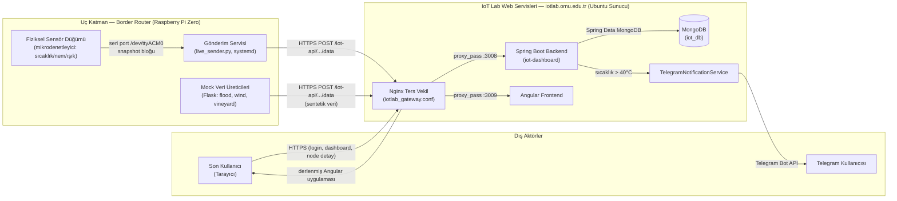
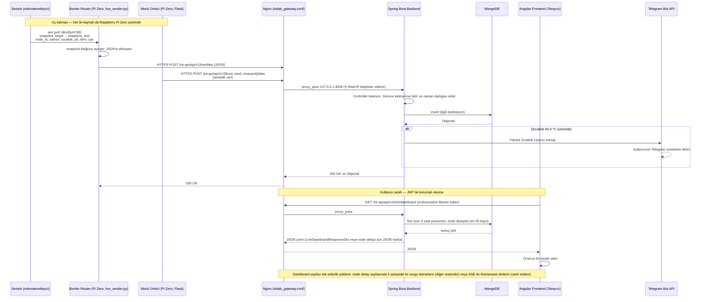
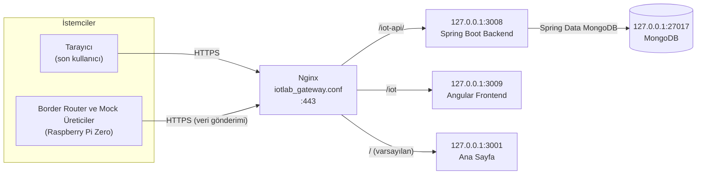

# Sistem Mimarisi

Bu doküman, OMÜ IoT Laboratuvarı projesinin uçtan uca mimarisini
anlatır: sensörden/mock üreticiden gelen verinin hangi bileşenlerden
geçerek veritabanına yazıldığını ve son kullanıcıya nasıl sunulduğunu açıklar.
Bu dosya dokümantasyonun omurgasıdır; diğer tüm `docs/` dosyaları
buradaki bileşen ve katman tanımlarına referans verir.

## 1. Amaç ve Kapsam

Proje, Ondokuz Mayıs Üniversitesi Bilgisayar Mühendisliği Bölümü bünyesinde yayında olan
`iotlab.omu.edu.tr` sayfasını tek bir senaryoya özel "kapalı kutu"
olmaktan çıkarıp farklı IoT araştırma projelerine hizmet verebilecek,
"mekan bağımsız" ve ölçeklenebilir bir sunucu altyapısına dönüştürmeyi
amaçlar.

Çözülmek istenen problem: var olan IoT laboratuvar sistemlerinin
çoğunlukla belirli bir senaryoya özel tasarlanmış olması ve her yeni
proje için altyapının sıfırdan kurulması ihtiyacı.

## 2. Sistem Bağlam Diyagramı

## 3. Katmanlı Mimari

Sistem sekiz katman halinde ele alınabilir. Her katman aynı zamanda bir
sonraki katmana veri/istek aktaran bir sınırdır.

| # | Katman | Bileşen | Teknoloji | Çalıştığı Makine | Sorumluluk |
|---|---|---|---|---|---|
| 1 | Algılama  | Sensör | Firmware | Ayrı donanım (laboratuvarda hazır bulunan düğüm) | Sıcaklık/nem/ışık ölçümü; seri porta CSV benzeri satır yazma |
| 2 | Uç / Border Router | `live_sender.py`, systemd (`iot-sender.service`), Flask mock üreticiler | Python + Flask, Raspbian (armv6l) | Raspberry Pi Zero | `/dev/ttyACM0`'dan seri okuma, `snapshot_begin`/`snapshot_end` bloklarını ayrıştırma, JSON'a dönüştürme, HTTPS POST ile gönderim, sentetik veri üretimi | |
| 3 | Taşıma | HTTPS/TLS | Certbot sertifikaları | Sunucu ↔ Pi arası internet | Şifreli iletim, HTTP→HTTPS zorunlu yönlendirme |
| 4 | Ters Vekil (Gateway) | Nginx | `iotlab_gateway.conf` | Ubuntu sunucu | Path bazlı yönlendirme|
| 5 | Uygulama | Spring Boot backend, Angular sunumu| Java 17 + Spring Boot 3.2.4, Angular 17| Dokku konteynerleri (Ubuntu sunucu) | REST API, JWT auth, iş mantığı
| 6 | Veri | MongoDB | MongoDB 8.0.12 | Dokku mongo konteyneri (Ubuntu sunucu) | Kalıcı veri saklama (`iot_data`, `live_data`, `flood_data`, `wind_data`, `users`) |
| 7 | Sunum | Angular dashboard | Angular 17, Chart.js/ng2-charts, Tailwind CSS | Son kullanıcının tarayıcısı | Grafik/tablo render; node detayında 5 sn polling (vineyard/wind/flood) veya SSE ile gerçek zamanlı akış (live-data). |
| 8 | Bildirim | `TelegramNotificationService` | Telegram Bot API | Backend içi (Dokku konteyneri) → dış Telegram servisi | Sıcaklık eşiği aşıldığında (`> 40.0 °C`) otomatik uyarı |

## 4. Bileşen Envanteri

| Bileşen | Teknoloji + Sürüm | Çalıştığı Makine | Sorumluluk |
|---|---|---|---|
| Fiziksel sensör düğümü | Mikrodenetleyici firmware (marka/model bilinmiyor) | Ayrı donanım | Sıcaklık/nem/ışık ölçümü, seri çıktı |
| Mock veri üreticileri | Python + Flask | Raspberry Pi Zero | `flood`/`wind`/`vineyard` için sentetik veri üretip backend'e POST etme |
| Border router | Raspberry Pi Zero, Python (`live_sender.py`), systemd (`iot-sender.service`) | Raspberry Pi Zero (Raspbian, armv6l) | Seri okuma, protokol dönüşümü, HTTPS gönderim |
| Ters vekil / gateway | Nginx | Ubuntu sunucu | Path bazlı yönlendirme, TLS sonlandırma |
| PaaS / konteyner orkestrasyonu | Dokku | Ubuntu sunucu | `git push` ile deployment, konteyner yaşam döngüsü, mongo eklentisi |
| Backend | Spring Boot 3.2.4, Java 17 | Dokku konteyneri (Ubuntu sunucu), iç yönlendirme `:3008` | REST API, JWT kimlik doğrulama, iş mantığı, Telegram tetikleme |
| Veritabanı | MongoDB 8.0.12 | Dokku mongo konteyneri (Ubuntu sunucu) | Kalıcı veri saklama |
| Frontend | Angular 17 | Dokku konteyneri (Ubuntu sunucu), iç yönlendirme `:3009` | Dashboard/History/NodeDetail arayüzü |
| Bildirim kanalı | Telegram Bot API | Dış servis (Telegram) | Sıcaklık eşik uyarısı iletimi |
| Son kullanıcı | Tarayıcı | İstemci makinesi | Dashboard görüntüleme, giriş yapma |
| Sunucu (host) | Ubuntu Server 24.04.2 LTS | Fiziksel makine | Tüm Dokku konteynerlerini ve Nginx'i barındırma |

## 5. Uçtan Uca Veri Akışı

Aşağıdaki diyagram `live-data` sistemi (gerçek fiziksel sensör) için
uçtan uca akışı gösterir. `vineyard`/`wind`/`flood` sistemlerinde
sensör ve seri port okuma adımları yoktur; bunların yerine aynı
Raspberry Pi Zero üzerinde çalışan Flask tabanlı mock üreticiler
sentetik veriyi doğrudan üretip aynı uçlara gönderir. Akışın
gateway'den sonraki kısmı her iki durumda da özdeştir (bkz. §6).

## 6. Ağ Topolojisi ve Port Planı

Sunucuya gelen tüm istekler tek bir giriş noktasından, 443 numaralı
port üzerindeki Nginx'ten geçer. Nginx isteği path'ine bakarak
ilgili Dokku uygulamasının dinlediği yerel porta yönlendirir. Dışarıya
açık tek port 443'tür; uygulama portlarının hiçbiri doğrudan
erişilebilir değildir.

| Path | Hedef Port | Servis | Not |
|---|---|---|---|
| `/iot-api/` | `127.0.0.1:3008` | Spring Boot backend | Hem border router ve mock üreticilerin veri gönderdiği hem de arayüzün sorgu attığı uç. İstemci bilgisini taşımak için `X-Real-IP`, `X-Forwarded-For` ve `X-Forwarded-Proto` başlıkları ekleniyor. |
| `/iot` | `127.0.0.1:3009` | Angular frontend | Sondaki eğik çizgi eksikse 301 ile `/iot/` adresine yönlendiriliyor. |
| `/` (varsayılan) | `127.0.0.1:3001` | Ana Sayfa | Yukarıdaki path'lerle eşleşmeyen tüm istekler buraya düşüyor. Bu portta projeden bağımsız olarak okulun kendi sayfası bulunmaktadır.Proje kapsamı dışındadır.|
| — | `127.0.0.1:27017` | MongoDB | Yalnızca yerel arayüzde dinliyor, dışarıya kapalı. |

## 8. Güven Sınırları

`WebSecurityConfig.java`'daki yetkilendirme kuralları özeti:

| Uç | Auth | Mimari Gerekçe |
|---|---|---|
| `POST /api/v1/auth/login` | Herkese açık | Kimlik doğrulama akışının kendisi |
| `POST /api/v1/{iot,wind,flood,live}/data` | **Herkese açık** | Sensör/mock üreticiler token'sız veri gönderebilsin diye |
| `GET /api/v1/{iot,wind,flood,live}/export/csv` | **Herkese açık** | Rapor/analiz amaçlı dışa aktarım |
| `GET /api/v1/{system}/dashboard` | JWT gerekli | Özet istatistikler |
| `GET /api/v1/{system}/node/{id}` | JWT gerekli | Node detay verisi |
| `GET /api/v1/live/stream` | JWT gerekli | Canlı sistemde SSE (Server-Sent Events) ile anlık veri akışı |
| Kalan her şey | JWT gerekli | Varsayılan kapalı |

## Tasarım Kararları, Nedenleri ve Bedelleri

| Karar | Alternatif | Neden | Bedel |
|---|---|---|---|
| Ubuntu Server (arayüzsüz) | Belirtilmemiş | Kesintisiz çalışma (nadiren reboot gerektirir), arayüzsüz olduğu için CPU/RAM'in konteynerlere/veritabanına ayrılabilmesi, topluluk denetimiyle hızlı güvenlik yaması alabilmesi | Tek/yedeksiz sunucu, donanım arızasında tek nokta hatası|
| Docker konteynerizasyon | Geleneksel VM (hypervisor tabanlı) | VM'lerden daha hafif (host çekirdeğini paylaşır), izolasyon, "lokalimde çalışıyordu" sorununu giderir ve yüksek taşınabilirlik | - |
| Dokku (PaaS) | Manuel sunucu yönetimi | `git push` ile otomatik deployment, Nginx/SSL otomasyonu, operasyonel yükü azaltma | Dokku'nun varsayılan Nginx otomasyonu çoklu servis/çoklu teknoloji ihtiyacını karşılamadığı için manuel/özel reverse proxy yazmak zorunda kalındı. |
| Manuel Nginx reverse proxy | Dokku'nun varsayılan Nginx yönlendirmesi | Çoklu servis/çoklu teknolojiyi tek makinede path bazlı barındırma ihtiyacı Dokku otomasyonunun sınırlarını aşıyor | Ek mühendislik/bakım yükü (config'in elle güncel tutulması) |
| MongoDB (NoSQL) | Geleneksel RDBMS | Sensör verisinin sabit şemaya sahip olmayabilmesi; yeni sensör tipi eklendiğinde şema migrasyonu gerekmemesi. | - |
| JWT (stateless auth) | Session tabanlı kimlik doğrulama | Sunucuda oturum tutmama, çok sayıda cihazın eşzamanlı bağlanabilmesi | RBAC henüz yok |
| Domain-agnostic routing (`systemType` parametresi) | Her senaryo için ayrı, sabit kodlu (hard-coded) arayüz | Aynı bileşenin (`DashboardComponent` vb.) farklı sensör sistemlerine (vineyard/wind/flood/live-data) uyarlanabilmesi.| Kodlama zorluğu |

## İlgili Dokümanlar

- [01-overview.md](01-overview.md) — Genel bakış, problem, kapsam
- [02-requirements.md](02-requirements.md) — Gereksinimler
- [04-hardware-and-sensors.md](04-hardware-and-sensors.md) — Donanım ve sensörler
- [05-border-router.md](05-border-router.md) — Raspberry Pi, seri okuma, gönderim
- [06-data-pipeline.md](06-data-pipeline.md) — Veri hattı, mock üreticiler
- [07-backend.md](07-backend.md) — Spring Boot
- [08-data-model.md](08-data-model.md) — MongoDB koleksiyonları
- [09-frontend.md](09-frontend.md) — Angular
- [10-server-setup.md](10-server-setup.md) — Ubuntu sunucu kurulumu
- [11-dokku-paas.md](11-dokku-paas.md) — Dokku PaaS
- [12-nginx-gateway.md](12-nginx-gateway.md) — Nginx reverse proxy / gateway

