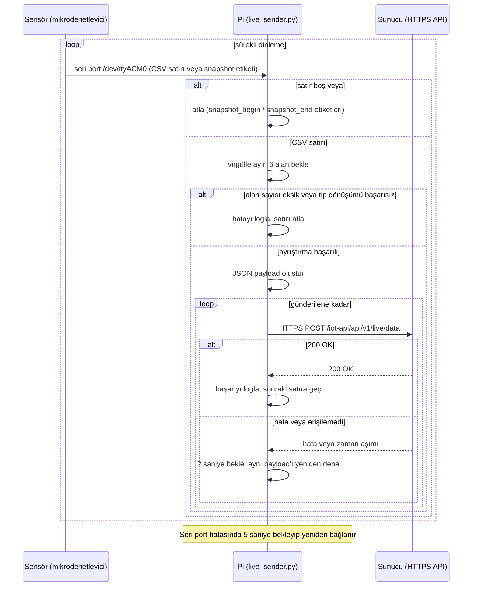

# Border Router (Raspberry Pi Zero)

Bu doküman, Raspberry Pi Zero üzerinde çalışan gönderim yazılımını anlatır:
sensör ağından gelen ham veriyi seri porttan okuyup IP dünyasına aktaran
köprü katmanı. Cihazın donanım kimliği (model, kernel, mimari)
[04-hardware-and-sensors.md](04-hardware-and-sensors.md)'te, sistemdeki
yeri ve uçtan uca akıştaki konumu
[03-system-architecture.md](03-system-architecture.md)'te ele alınmıştır;
burada yalnızca Pi üzerinde çalışan yazılım konu edilir.



## Neden Ayrı Bir Border Router?

Rapor, Pi'nin bu rolünü şöyle gerekçelendiriyor:

> "Sunucuyu kullanabilecek fiziksel veri toplama katmanı ile merkezi
> sunucu altyapısı arasında köprüyü kurmak sebebiyle, ana sunucunun
> donanım mimarisinde bir Raspberry Pi cihazı 'Sınır Yönlendirici'
> olarak konumlandırılmıştır. Sahada bulunabilecek ve genellikle düşük
> batarya gücüne sahip olan, kısıtlı donanım kaynaklarına sahip farklı
> tipteki IoT sensör düğümleri, doğrudan global internete çıkmak
> yerine verilerini yerel iletişim protokolleri üzerinden bu sınır
> yönlendiriciye aktarmaktadır. Bu bağlamda Raspberry Pi, adeta bir uç
> bilişim düğümü gibi hareket ederek yerel sensör ağı ile geniş alan
> ağı (İnternet) arasında protokol dönüşümünü ve veri paketlemesini
> gerçekleştirmiştir. Bu yaklaşım, ağ trafiğini optimize etmiş ve
> sahada toplanan verilerin merkezi sunucuya güvenli bir tünel
> üzerinden iletilmesine olanak tanımıştır.

Kısaca: sensör düğümü kısıtlı donanımlı ve düşük güçlü olduğu için
geniş alan ağına doğrudan çıkmak yerine, yerel seri bağlantıyla Pi'ye
veri basıyor; Pi protokol dönüşümünü (seri CSV → HTTPS/JSON) ve
paketlemeyi üstleniyor. 

Pi'nin sistemdeki rolü yalnızca aktarımla sınırlı değildir: sel, rüzgâr
ve bağ senaryolarının sentetik verisini üreten mock üreticiler de aynı
cihaz üzerinde çalışır. Yani Pi,
sistemin tüm veri üretim ve iletim yükünü tek başına taşıyan uç
katmandır.

## Gönderim Script'i (live_sender.py)

| Gözlem | Script kodu | Üretim log'u (MEDIA-INDEX) |
|---|---|---|
| Ham veri satırı | `📤 Ham Veri: {line}` | `📤 Ham Veri: <node_id,zaman,...>` |
| Başarı satırı | `✅ İletildi! \| Node ID: {...} \| Temp: {...}°C` | `✅ İletildi! \| Node ID: X \| Temp: 23.16°C` |
| Hata satırı | `⚠️ Hata: Gelen veri eksik veya hatalı, atlanıyor...` | Aynı metin |


Script'in tam akışı:

1. **Yapılandırma.** `API_URL` (varsayılan
   `https://iotlab.omu.edu.tr/iot-api/api/v1/live/data`), `SERIAL_PORT`
   (varsayılan `/dev/ttyACM0`), `BAUD_RATE` (varsayılan `115200`)  `RECONNECT_DELAY = 5` ve
   `POST_RETRY_DELAY = 2` sabittir.
2. Seri port açılır, satır satır okunur.
3. Boş satırlar ve `#` ile başlayan çerçeve etiketleri atlanır.
4. Satır virgülden bölünür; altı alandan azsa veya tip dönüşümü
   başarısızsa loglanıp atlanır.
5. Altı alan `node_id`, `time_s`, `temperature`, `battery`,
   `humidity`, `light` anahtarlarıyla bir JSON nesnesine dönüştürülür.
6. `requests.post(API_URL, json=payload, timeout=5)` ile gönderilir.
7. HTTP 200 dönerse başarı loglanır ve sonraki satıra geçilir. 200
   dışında bir kod veya bağlantı hatası durumunda `POST_RETRY_DELAY`
   (2 sn) beklenip **aynı payload sınırsız kez** yeniden denenir —
   üst sınır yok.
8. Seri port hatası (`serial.SerialException`) durumunda
   `RECONNECT_DELAY` (5 sn) beklenip dış döngü yeniden bağlanmayı
   dener; bu da sınırsızdır.
9. `KeyboardInterrupt` temiz çıkışla sonlanır; diğer beklenmedik
   hatalar yakalanıp loglanır, 5 saniye beklenip döngüye devam edilir.

Loglama Python'un `logging` modülüyle değil, düz `print()` ile
yapılıyor; dosyaya yazma işini script değil systemd üstleniyor.

## Mock Veri Üreticileri

Sel, rüzgâr ve bağ senaryolarının verisi gerçek bir sensörden değil,
aynı Raspberry Pi üzerinde çalışan Python/Flask tabanlı mock
üreticilerden gelir. Bu üreticiler belirli aralıklarla gerçekçi
değer aralıklarında sentetik veri üretip backend'in ilgili veri alım
uçlarına doğrudan HTTPS POST atar. Backend açısından bu veri, gerçek
sensörden gelen veriden ayırt edilemez; aynı uçlar, aynı gövde yapısı
kullanılır.

## Loglama

`live_sender.log` (standart çıktı) ve `live_sender_error.log` (hata
çıktısı) ayrımı script içinde değil, systemd unit dosyasındaki
yönlendirmeyle sağlanıyor:

```ini
StandardOutput=append:/home/zero/live_sender.log
StandardError=append:/home/zero/live_sender_error.log
```


```
📤 Ham Veri: <node_id,zaman,pil,sıcaklık,...>
✅ İletildi! | Node ID: X | Temp: 23.16°C
```

Bu ikili yapı basit ama etkili bir izleme mekanizması kuruyor: her
ham satırın karşısında bir onay satırı bulunmalı. Onay satırı
gelmemişse ya ayrıştırma başarısız olmuş ya da gönderim hâlâ retry
döngüsündedir. Log'a bakan biri sistemin sağlığını başka bir araca
ihtiyaç duymadan anlayabilir.


```ini
# Python tamponlamasını kapatarak çıktıları anında loglara yazdırır
Environment=PYTHONUNBUFFERED=1
```

Bu satırın açıklaması şudur: Python'un standart çıktısı bir dosyaya
veya pipe'a yönlendirildiğinde varsayılan olarak
blok bazlı tamponlanır — bu da log dosyasına yazımın gecikmeli ve
toplu olmasına yol açar. `tail -f` ile canlı izleme yapılırken uzun
süre hiçbir satır görünmeyip sonra hepsinin birden düşmesi bu
davranışın tipik belirtisidir. `PYTHONUNBUFFERED=1` tamponlamayı
kapatıp her `print()` çağrısının anında yazılmasını sağlıyor.

## systemd Servisi (iot-sender.service)

Servisin unit dosyası:

```ini
[Unit]
Description=IoT Canli Veri Gonderici Servisi
After=network.target

[Service]
# Python tamponlamasını kapatarak çıktıları anında loglara yazdırır
Environment=PYTHONUNBUFFERED=1

ExecStart=/usr/bin/python3 /home/zero/live_sender.py
WorkingDirectory=/home/zero
Restart=always
RestartSec=5
User=zero

# Çıktıların yazılacağı hedef log dosyaları
StandardOutput=append:/home/zero/live_sender.log
StandardError=append:/home/zero/live_sender_error.log

[Install]
WantedBy=multi-user.target
```


## 7/24 Çalışma ve Dayanıklılık

Sistemde üç ayrı dayanıklılık katmanı üst üste biniyor:

1. **Gönderim retry'si.** Sunucuya POST başarısız olursa script 2
   saniye bekleyip aynı payload'ı sınırsız kez yeniden dener. Kısa
   süreli ağ kesintileri veya sunucu yeniden başlatmaları veri
   kaybına yol açmaz.
2. **Seri yeniden bağlanma.** Seri port hatası oluşursa 5 saniye
   beklenip bağlantı yeniden kurulur. Sensör kablosunun çıkıp
   takılması gibi durumlar script'i öldürmez.
3. **systemd yeniden başlatma.** Script tamamen çökerse (yakalanmayan
   bir hata) systemd 5 saniye içinde süreci ayağa kaldırır. Bu katman
   script içi mantıktan bağımsızdır.

Seri porttan uzun süre veri gelmemesi durumunda `ser.readline()`
çağrısı 1 saniyelik zaman aşımıyla boş dize döndürüyor ve kod döngüye
devam ediyor — süreç bloklanmıyor, boşta beklerken de canlı kalıyor.

Bu tasarımın kabul ettiği risk şu: gönderim retry döngüsündeyken
seri porttan gelen yeni satırlar işletim sistemi seviyesindeki seri
tamponda birikir. Sunucu kesintisi uzarsa bu tampon dolabilir ve o
sürede gelen ölçümler kaybolabilir. Script'in bellekte kuyruk tutma
veya diske yazma mekanizması tasarlanmamıştır.


## İlgili Dokümanlar

- [03-system-architecture.md](03-system-architecture.md) — Uçtan uca mimari, border router'ın sistemdeki yeri
- [04-hardware-and-sensors.md](04-hardware-and-sensors.md) — Pi donanım kimliği, ham seri veri formatı, sensör düğümü
- [06-data-pipeline.md](06-data-pipeline.md) — Veri hattının devamı, mock üreticiler ve veri kalitesi
- [07-backend.md](07-backend.md) — Border router'ın veri gönderdiği backend uç noktası
lar
