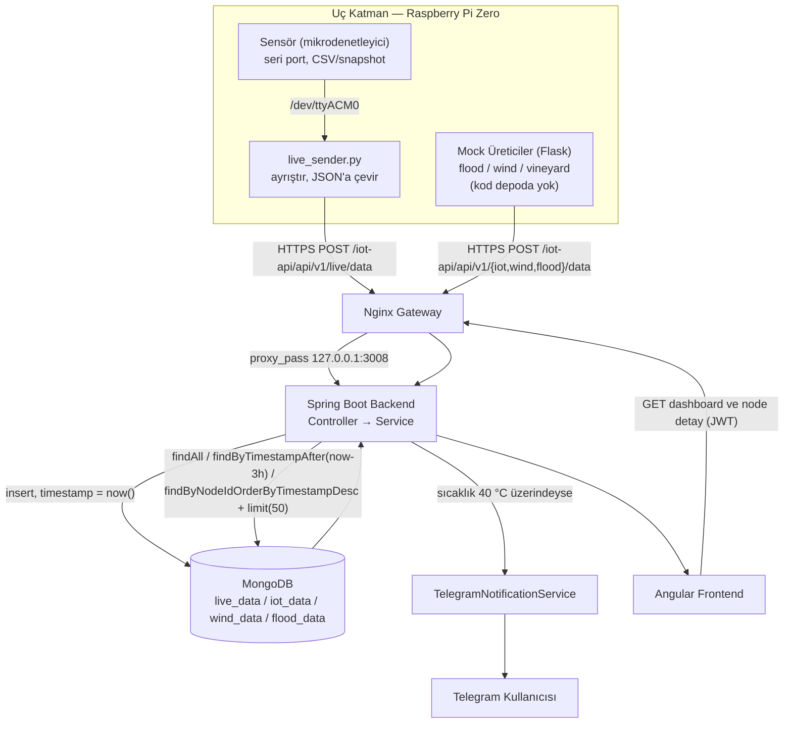

# Veri Hattı (Data Pipeline)


Bu doküman, verinin üretildiği andan (fiziksel sensör veya mock
üretici) MongoDB'ye yazılıp Angular arayüzünde görünmesine kadar
geçirdiği **her biçim dönüşümünü** adım adım izler.
[03-system-architecture.md](03-system-architecture.md) sistemi
kuşbakışı, bileşen/katman düzeyinde anlatır; bu doküman aynı
sistemi **veri perspektifinden** ele alır ve 03'teki tabloları
tekrar etmez. Backend'in iç mimarisi (controller/service/repository
katmanları) için [07-backend.md](07-backend.md), MongoDB koleksiyon
şemalarının tam alan listesi için [08-data-model.md](08-data-model.md)
kaynaktır.


## Uçtan Uca Akış (Gerçek Hat + Mock Hat)





## 1. İki Ayrı Veri Kaynağı


Sistemdeki 4 "sistem tipi"nden yalnızca biri gerçek fiziksel
sensörden beslenir; diğer üçü mock (simüle) üreticilerden gelir.
Bu ayrım, verinin hattaki güvenilirliğini doğrudan etkilediği için
kritiktir aşağıdaki tablo veri akışı açısından bu iki yolu
karşılaştırır.


| Sistem | Veri Kaynağı | Üretici | Hedef Uç | Koleksiyon |
|---|---|---|---|---|
| `live-data` | **GERÇEK** | Fiziksel sensör → Raspberry Pi Zero (`live_sender.py`) | `POST /iot-api/api/v1/live/data` | `live_data` |
| `vineyard` | **MOCK** | Raspberry Pi Zero üzerindeki Flask mock üretici | `POST /iot-api/api/v1/iot/data` | `iot_data` |
| `wind` | **MOCK** | Raspberry Pi Zero üzerindeki Flask mock üretici | `POST /iot-api/api/v1/wind/data` | `wind_data` |
| `flood` | **MOCK** | Raspberry Pi Zero üzerindeki Flask mock üretici | `POST /iot-api/api/v1/flood/data` | `flood_data` |


Her iki kaynak da aynı fiziksel cihazda — Raspberry Pi Zero üzerinde —
çalışır ve aynı gateway üzerinden aynı desendeki uçlara veri gönderir.
Backend açısından ikisi arasında hiçbir fark yoktur; ayrım yalnızca
verinin gerçekliği bakımından anlamlıdır.Projenin asıl amacı veri toplamak değil, çeşitli sistemlerden gelen verileri işleyebilecek genişletilebilir bir labratuvar ortamının tasarımıdır. Bu bağlamda bunun bir lisans bitirme projesi olduğunu düşünürsek mock data kullanmak geçerli bir yöntemdir. Yine de kanıtlanabilirlik açısından bir sensör de olsa test ettik.


## 2. Gerçek Sensör Hattı — Dönüşüm Zinciri


Verinin biçim değiştirdiği her nokta sırasıyla:


### 2.1 Ham seri satır


Mikrodenetleyici, ölçtüğü veriyi `/dev/ttyACM0` üzerinden
`snapshot_begin`/`snapshot_end` bloklu, virgülle ayrılmış CSV
satırları hâlinde Pi'ye basar.


### 2.2 Pi'da ayrıştırma ve JSON'a dönüştürme


Bu, hattaki en önemli biçim dönüşümüdür: **CSV → JSON dönüşümü
sunucuda değil, Pi üzerinde yapılır.**


`live_sender.py` önce çerçeve etiketlerini eler (`#` ile başlayan
satırlar atlanır), ardından kalan satırı virgülden bölüp altı alan
bekler ve her alanı uygun tipe dönüştürerek bir JSON nesnesi kurar.
İki ayrı savunma katmanı vardır: alan sayısı eksikse satır atlanır,
tip dönüşümü başarısız olursa yine atlanır. Her iki durumda da atlama
loglanır — üretim log'undaki **"⚠️ Hata: Gelen veri eksik veya
hatalı, atlanıyor..."** satırı bu kontrolün çıktısıdır.


Bu dönüşümün mimari anlamı şudur: backend, seri protokolün
ayrıntısından tamamen yalıtılmıştır. Sunucu yalnızca JSON konuşur ve
mock üreticiler de aynı sözleşmeyi kullanabilir.


### 2.3 JSON gövdesi


Sistemin uçtan uca test edilmesinde kullanılan  script'i
, `LiveData` modelinin alan adlarıyla
birebir örtüşen gerçek bir gövde örneği sağlar:


```json
{
 "node_id": 7777,
 "time_s": 100,
 "onchip_temp_c": 35.0,
 "battery_mv": 4000.0,
 "env_temp_c": 38.0,
 "humidity_rh": 45.0,
 "light_lux": 400.0
}
```


(Bu, manuel test enjeksiyonu için kullanılan gövdedir; gerçek
sensörden gelen değerler farklı olur ama alan adları ve şekli aynıdır.)


### 2.4 HTTPS POST


`live_sender.py` bu gövdeyi `requests.post(API_URL, json=payload,
headers={"Content-Type": "application/json"}, timeout=5)` ile
gönderir; `API_URL` varsayılanı
`https://iotlab.omu.edu.tr/iot-api/api/v1/live/data`'dır. Gönderim başarısız
olursa aynı payload 2 saniye aralıkla sınırsız kez yeniden denenir.Bu sunursuz denemenin amacı sunucuda veri biriktirmektir bu sayede hem performansı gözlemlemiş olduk hem de projeyi sunarken boş bir data ile jüri karşısına çıkmak istemedik.


### 2.5 Nginx gateway path eşlemesi


İstek `/iot-api/` path'inde eşleşir ve `127.0.0.1:3008`'e proxy
edilir; `X-Real-IP`, `X-Forwarded-For`, `X-Forwarded-Proto`
header'ları eklenir. Ayrıntı:
[12-nginx-gateway.md](12-nginx-gateway.md).


### 2.6 Dokku konteyneri


İstek, Dokku'nun barındırdığı Spring Boot konteynerine ulaşır.
Konteyner yaşam döngüsü için: [11-dokku-paas.md](11-dokku-paas.md).


### 2.7 Controller ve model nesnesi


`LiveDataController.receiveLiveData` (`@PostMapping("/data")`),
gövdeyi doğrudan `LiveData` nesnesine deserialize edip `@Valid` ile
doğruluyor ancak model sınıfındaki tek doğrulama kısıtı `node_id`
alanı üzerindeki `@NotNull`'dır; diğer alanlar (örn. `env_temp_c`)
için bir aralık/mantık kontrolü yoktur:


```java
@PostMapping("/data")
public ResponseEntity<?> receiveLiveData(@Valid @RequestBody LiveData data) {
   LiveData savedObject = liveDataService.saveData(data);
   return ResponseEntity.ok("Canlı sensör verisi başarıyla alındı ve kaydedildi. ID: " + savedObject.getId());
}
```


Dönen yanıt **JSON değil, düz metindir** — yalnızca başarı mesajı ve
oluşturulan MongoDB `ObjectId`'sini içerir.


`LiveDataService.saveData`, kayıt zamanını ekler (bkz. §7),
kaydeder ve eşik kontrolü yapar:


```java
public LiveData saveData(LiveData data) {
   data.setTimestamp(LocalDateTime.now());
   LiveData savedData = liveDataRepository.save(data);
   ...
}
```


### 2.8 MongoDB dokümanı


```json
{
 "_id": ObjectId("..."),
 "node_id": 12960,
 "time_s": 341102,
 "onchip_temp_c": 24,
 "battery_mv": 3289,
 "env_temp_c": 23.1628,
 "humidity_rh": 56.28,
 "light_lux": 2.32,
 "timestamp": ISODate("2026-06-02T09:37:00"),
 "_class": "com.iot.dashboard.model.LiveData"
}
```


## 3. Mock Hattı


`flood`, `wind` ve `vineyard` sistemlerinin verisi, Python + Flask ve Bash Script
ile yazılmış mock üreticilerden gelir. Bu üreticiler **gerçek
sensörün bağlı olduğu aynı Raspberry Pi Zero üzerinde** çalışır;
belirli aralıklarla gerçekçi görünen rastgele veri üretip backend'in
ilgili `/data` ucuna doğrudan HTTPS POST atarlar.


Mock üreticilerin uç katmanda konumlandırılması, mimari sınırı net
tutar: Pi tüm veri üretim ve iletim yükünü taşıyan taraf, sunucu ise
yalnızca veri alan taraftır. Bunun bedeli, Pi'nin sistemin tek
üretim noktası hâline gelmesidir.


## 4. Mock Verinin Meşruiyeti


Sistemde tek bir fiziksel sensör düğümü var, ama platform 4 farklı
senaryoyu (tarım/bağ, rüzgâr/liman, akarsu/sel, canlı telemetri)
aynı senaryo-bağımsız mimariyle destekliyor. Tek
sensörle 4 senaryoyu fiziksel olarak kurmak (farklı donanım, farklı
saha) bir lisans bitirme projesi kapsamında pratik değil; mock veri
üretimi, mimarinin (controller → service → repository → koleksiyon
deseni, senaryo-bağımsız frontend yönlendirmesi) birden fazla
senaryoda gerçekten çalıştığını göstermenin makul bir yoludur.


Ama bunun bir sınırı var: mock veri, gerçek dünyanın getirdiği
gürültüyü (sensör kalibrasyon sapması, kısmi arızalar), donanım
arızalarını (pil bitmesi, bağlantı kopması) ve ağ kesintilerini
(paket kaybı, gecikme dalgalanması) temsil etmez. `live-data`
sisteminde gözlemlenen `-999.0` sentinel hatası (bkz. §6) gibi
gerçek dünya arızaları, tanım gereği mock üreticilerde
oluşmayacaktır — çünkü üretici, gerçekçi *görünen* veri üretmek
üzere tasarlanmıştır, gerçek sensör arızalarını simüle etmek üzere
değil.


## 5. Veri Doğrulama ve Kalite


Zincir boyunca doğrulama yalnızca **iki** noktada var, ikisi de
kısmi:


1. **Pi'da** — bozuk/eksik seri satırlar loglanıp atlanıyor (bkz.
  §2.2, [05-border-router.md](05-border-router.md)). Bu kontrol
  satırın *ayrıştırılabilirliğini* ölçüyor: alan sayısı doğru mu,
  değerler sayıya çevrilebiliyor mu. İçindeki değerlerin *mantıklı*
  olup olmadığına bakmıyor.
2. **Backend'de** — `receiveLiveData(@Valid @RequestBody LiveData
  data)` üzerinde `@Valid` doğrulaması devrede (bkz. §2.7), ama
  model sınıfındaki tek kısıt `node_id` alanındaki `@NotNull`'dır;
  diğer alanlar için bir aralık/mantık kontrolü yok. Yani gövde
  şekli JSON deserializasyonuyla uyuşuyorsa (doğru alan adları,
  doğru tipler) ve `node_id` doluysa, diğer her değer olduğu gibi
  kabul ediliyor.


## 6. Bildirim Dalı


Sıcaklık eşiği aşıldığında Telegram bildirimi tetikleniyor; ancak bu
mekanizma dört sistemin tamamında değil, yalnızca `iot` (vineyard)
ve `live-data` sistemlerinde çalışıyor — `WindDataService` ve
`FloodDataService` içinde böyle bir tetikleme yok. Mekanizma: `saveData`
içinde, kayıt sonrası sıcaklık alanı 40.0 °C'yi aşarsa
`TelegramNotificationService.sendMessage` çağrılıyor.
`LiveDataService` için mesaj biçimi:


```java
"🚨 *Canlı Sistem - Yüksek Sıcaklık Uyarısı!* 🚨\nNode ID: %d\nÖlçülen Sıcaklık: %.2f °C\nNem: %.2f %%RH\nSaat: %s\nLütfen cihazı kontrol ediniz."
```


## Tasarım Kararları ve Ödünleşimler


| Karar | Alternatif | Neden | Bedel |
|---|---|---|---|
| CSV → JSON dönüşümünü Pi'de yapmak | Ham CSV'yi sunucuya gönderip orada ayrıştırmak | Backend seri protokolün ayrıntısından yalıtılır; sunucu yalnızca JSON konuşur ve mock üreticiler aynı sözleşmeyi kullanabilir | Düşük pil gücü olan sensöre binen ekstra yük |
| Tüm veri üretimini uç katmanda toplamak | Mock üreticileri sunucuda ayrı bir uygulama olarak barındırmak | Mimari sınır netleşir: Pi üretir ve gönderir, sunucu yalnızca alır. Backend açısından gerçek ve sentetik veri ayırt edilemez, bu da senaryo-bağımsız mimarinin sınandığı anlamına gelir | Pi tek üretim noktası hâline gelir; cihaz kapandığında dört senaryonun tamamı susar |
| Bildirimi kayıt akışı içinde senkron tetiklemek | Ayrı bir kuyruk veya asenkron görev | Ek altyapı gerektirmez, uyarı kayıtla aynı anda gider | Telegram API'sindeki gecikme doğrudan veri alım ucunun yanıt süresine yansır |
| Doğrudan HTTPS POST | MQTT broker veya mesaj kuyruğu | Rapor REST/JSON'ın stateless yapısını, düşük veri boyutunu ve platform bağımsızlığını gerekçe gösteriyor; ek broker altyapısı gerekmiyor | Kalıcı kuyruk olmadığı için uzun kesintilerde tamponlama Pi'nin bellek içi retry döngüsüne kalır; süreç yeniden başlarsa işlenmekte olan veri kaybolabilir |


## İlgili Dokümanlar


- [03-system-architecture.md](03-system-architecture.md) — Uçtan uca mimari, sistem tipleri, güven sınırları
- [04-hardware-and-sensors.md](04-hardware-and-sensors.md) — Ham sensör verisi, `-999.0` davranışı
- [05-border-router.md](05-border-router.md) — Pi üzerindeki gönderim script'i ve CSV ayrıştırma
- [07-backend.md](07-backend.md) — Spring Boot iç mimarisi
- [08-data-model.md](08-data-model.md) — MongoDB koleksiyon şemaları
- [11-dokku-paas.md](11-dokku-paas.md) — Dokku konteynerleri
- [12-nginx-gateway.md](12-nginx-gateway.md) — Path/port eşlemesi
