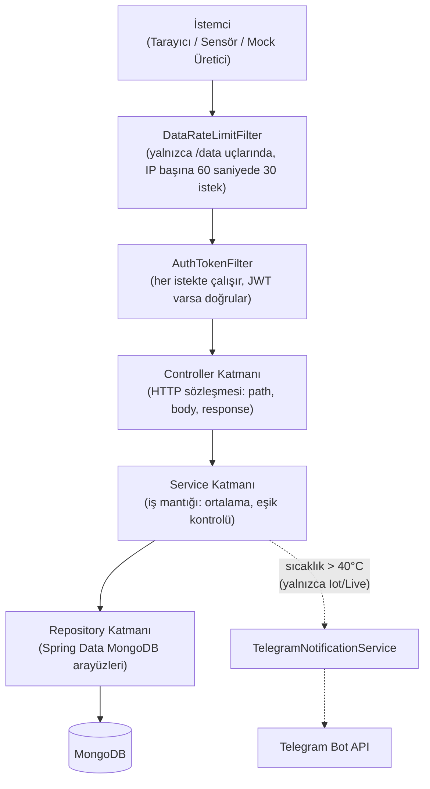

# Backend (Spring Boot)


Bu doküman, `iot-dashboard` Spring Boot uygulamasının **iç mimarisini**
anlatır: paket yapısı, katmanların sorumluluk dağılımı, controller/
service/repository sınıflarının tek tek ne yaptığı, JWT filtre zinciri
ve yapılandırma anahtarları gibi konulara değinilmiştir.


## 1. Teknoloji Yığını


`pom.xml`'den birebir:


| Bağımlılık | Sürüm | Amaç |
|---|---|---|
| `spring-boot-starter-parent` | 3.2.4 | Spring Boot parent BOM |
| Java | 17 | `<java.version>` |
| `spring-boot-starter-web` | (parent'tan) | REST API, gömülü Tomcat |
| `spring-boot-starter-data-mongodb` | (parent'tan) | MongoDB erişimi |
| `spring-boot-starter-security` | (parent'tan) | Spring Security 6 |
| `spring-boot-starter-validation` | (parent'tan) | Bean Validation (`jakarta.validation`) |
| `lombok` | (parent'tan) | `@Data`/`@Builder`/`@RequiredArgsConstructor` kod üretimi |
| `jjwt-api` / `jjwt-impl` / `jjwt-jackson` | 0.11.5 | JWT üretimi ve doğrulaması |
| `spring-boot-starter-test`, `spring-security-test` | (parent'tan) | Test (scope: test) |


## 2. Mimari Yaklaşım


Uygulama, tek bir Spring Boot sürecinde çalışan **katmanlı monolit**
(layered monolith) olarak yapılandırılmıştır: `controller` →
`service` → `repository` → `model`.


Paket ağacı (`com.iot.dashboard` kökü altında):


```
com.iot.dashboard
├── IotDashboardApplication.java          (Spring Boot giriş sınıfı, @SpringBootApplication)
├── config/
│   └── DataLoader.java                   (CommandLineRunner — varsayılan admin oluşturucu)
├── controller/
│   ├── AuthController.java
│   ├── FloodController.java
│   ├── IotDataController.java
│   ├── LiveDataController.java
│   └── WindController.java
├── dto/
│   ├── DashboardResponseDto.java
│   ├── FloodDashboardResponseDto.java
│   ├── IotDataDto.java
│   ├── JwtResponse.java
│   ├── LiveDashboardResponseDto.java
│   ├── LoginRequest.java
│   ├── NodeDetailResponseDto.java
│   └── WindDashboardResponseDto.java
├── model/
│   ├── FloodData.java
│   ├── IotData.java
│   ├── LiveData.java
│   ├── User.java
│   └── WindData.java
├── repository/
│   ├── FloodDataRepository.java
│   ├── IotDataRepository.java
│   ├── LiveDataRepository.java
│   ├── UserRepository.java
│   └── WindDataRepository.java
├── security/
│   ├── AuthEntryPointJwt.java
│   ├── AuthTokenFilter.java
│   ├── DataRateLimitFilter.java
│   ├── JwtUtils.java
│   ├── TokenBlacklist.java
│   ├── UserDetailsImpl.java
│   ├── UserDetailsServiceImpl.java
│   └── WebSecurityConfig.java
└── service/
   ├── FloodDataService.java
   ├── IotDataService.java
   ├── LiveDataService.java
   ├── TelegramNotificationService.java
   └── WindDataService.java
```


## 3. Katman Sorumlulukları





- **Controller katmanı:** Yalnızca HTTP sözleşmesinden (path, HTTP
 metodu, `@RequestBody`/`@PathVariable` bağlama, `ResponseEntity`
 sarmalama) sorumludur; iş mantığı içermez, doğrudan ilgili service
 sınıfına delege eder.
- **Service katmanı:** İş mantığının tamamı buradadır, eşik kontrolü/bildirim tetikleme, zaman penceresi filtreleri,
 ortalama/istatistik hesaplama, CSV üretimi.
- **Repository katmanı:** Yalnızca veri erişimi — `MongoRepository`
 türetilen arayüzler, sorgu mantığı içermez.
- **Security katmanı:** Controller'dan önce devreye giren bir filtre
 zinciri (`DataRateLimitFilter` → `AuthTokenFilter`) ve yapılandırma
 (`WebSecurityConfig`) olarak tasarlanmıştır; hangi controller'ın
 hangi path'i tanımladığından bağımsız çalışır. `TokenBlacklist`,
 çıkış (logout) yapılmış JWT'leri bellek içinde tutarak
 `AuthTokenFilter`'ın bu token'ları geçersiz saymasını sağlar.
- **Bağımlılık yönü:** `controller → service → repository → model`,
 tek yönlü.


## 4. Controller Envanteri


Tüm controller'lar `@RestController` + `@CrossOrigin(origins =
{"http://localhost:4200", "${app.cors.allowed-origin:}"}, maxAge =
3600)` anotasyonuna sahip.


| Controller | Base Path | Endpoint | HTTP | İstek / Yanıt | Auth |
|---|---|---|---|---|---|
| `AuthController` | `/api/v1/auth` | `/login` | POST | `@Valid LoginRequest(username, password)` → `JwtResponse(jwt, id, username)` | Herkese açık |
| | | `/logout` | POST | `Authorization: Bearer <token>` header → düz metin ("Çıkış yapıldı."), token `TokenBlacklist`'e eklenir | Herkese açık |
| `IotDataController` | `/api/v1/iot` | `/data` | POST | `IotData` (body) → düz metin + `ObjectId` | Herkese açık |
| | | `/dashboard` | GET | — → `DashboardResponseDto` | JWT gerekli |
| | | `/export/csv` | GET | — → `text/csv` (tam çalışan, bkz. §10) | Herkese açık |
| | | `/node/{nodeId}` | GET | `nodeId: Long` → `NodeDetailResponseDto` | JWT gerekli |
| `LiveDataController` | `/api/v1/live` | `/data` | POST | `LiveData` (body) → düz metin + `ObjectId` | Herkese açık |
| | | `/dashboard` | GET | — → `LiveDashboardResponseDto` | JWT gerekli |
| | | `/export/csv` | GET | — → `text/csv` (tam çalışan, bkz. §10) | Herkese açık |
| | | `/node/{nodeId}` | GET | `nodeId: Long` → `Object` (Map) | JWT gerekli |
| | | `/stream` | GET | — → `text/event-stream` (SSE, `SseEmitter`) | JWT gerekli |
| `FloodController` | `/api/v1/flood` | `/data` | POST | `FloodData` (body) → düz metin + `ObjectId` | Herkese açık |
| | | `/dashboard` | GET | — → `FloodDashboardResponseDto` | JWT gerekli |
| | | `/export/csv` | GET | — → `text/csv` (tam çalışan, bkz. §10) | Herkese açık |
| | | `/node/{nodeId}` | GET | `nodeId: String` → `Object` (Map) | JWT gerekli |
| `WindController` | `/api/v1/wind` | `/data` | POST | `WindData` (body) → düz metin + `ObjectId` | Herkese açık |
| | | `/dashboard` | GET | — → `WindDashboardResponseDto` | JWT gerekli |
| | | `/export/csv` | GET | — → `text/csv` (tam çalışan, bkz. §10) | Herkese açık |
| | | `/node/{nodeId}` | GET | `nodeId: String` → `Object` (Map) | JWT gerekli |


## 5. Bildirim Servisi


`TelegramNotificationService`, `RestTemplate` ile Telegram Bot API'sinin `sendMessage` uç
noktasını çağırır:


```java
String url = "https://api.telegram.org/bot" + botToken + "/sendMessage";
Map<String, String> request = new HashMap<>();
request.put("chat_id", chatId);
request.put("text", message);
restTemplate.postForObject(url, request, String.class);
```


`botToken`/`chatId`, `@Value` ile `application.properties`'teki
`telegram.bot.token`/`telegram.chat.id` anahtarlarından okunuyor


## 6. Veri Erişim Katmanı


Tümü `MongoRepository<T, String>` türetilen 5 arayüz:


| Repository | Entity | Özel Sorgu Metotları |
|---|---|---|
| `IotDataRepository` | `IotData` | `findByTimestampAfter(LocalDateTime)`; `@Query("{ 'node_id' : ?0 }", sort="{ 'timestamp' : -1 }") findByNodeIdOrderByTimestampDesc(Long)` |
| `LiveDataRepository` | `LiveData` | Aynı desen, `@Query` ile `Long nodeId` |
| `FloodDataRepository` | `FloodData` | `findByTimestampAfter(LocalDateTime)`; `findByNodeIdOrderByTimestampDesc(String)` (method-name-derived); `findByNodeIdAndTimestampBetweenOrderByTimestampDesc(String, LocalDateTime, LocalDateTime)` |
| `WindDataRepository` | `WindData` | Aynı desen (`String nodeId`), aynı 3 metot |
| `UserRepository` | `User` | `findByUsername(String): Optional<User>`; `existsByUsername(String): Boolean` |


## 7. Yapılandırma


Tek bir `application.properties` dosyası var.


| Anahtar | Amaç |
|---|---|
| `server.port` | HTTP portu; `${PORT:8080}` ortam değişkeninden okunur, yoksa 8080 varsayılan |
| `server.tomcat.max-http-form-post-size` | Form/multipart POST gövdesi için üst boyut sınırı (1MB) |
| `server.tomcat.max-swallow-size` | Reddedilen isteklerde sunucunun swallow edeceği gövde için üst boyut sınırı (1MB) |
| `spring.data.mongodb.uri` | MongoDB bağlantı URI'si; `${MONGO_URL:mongodb://localhost:27017/iot-dashboard}` ortam değişkeninden okunur, yoksa yerel varsayılan |
| `iot.app.jwtSecret` | JWT imzalama anahtarı (Base64, HS256) |
| `iot.app.jwtExpirationMs` | JWT geçerlilik süresi değer `3600000` = 1 saat |
| `telegram.bot.token` | Telegram Bot API token'ı |
| `telegram.chat.id` | Bildirimlerin gönderileceği chat/kanal ID'si |
| `app.cors.allowed-origin` | CORS için izin verilen ek origin; `${CORS_ALLOWED_ORIGIN:}` ortam değişkeninden okunur |
| `app.admin.default-password` | `DataLoader` tarafından oluşturulan varsayılan admin kullanıcısının şifresi; `DEFAULT_ADMIN_PASSWORD` ortam değişkeninden okunur |
| `spring.main.banner-mode` | Spring Boot açılış banner'ının açık/kapalı olması |


## İlgili Dokümanlar


- [03-system-architecture.md](03-system-architecture.md) — Uçtan uca mimari, güven sınırları, port planı
- [06-data-pipeline.md](06-data-pipeline.md) — Veri hattı, controller/service kod kanıtları, doğrulama eksikliği
- [08-data-model.md](08-data-model.md) — MongoDB koleksiyon şemaları
- [11-dokku-paas.md](11-dokku-paas.md) — Dokku konteyneri, buildpack, ortam değişkenleri
