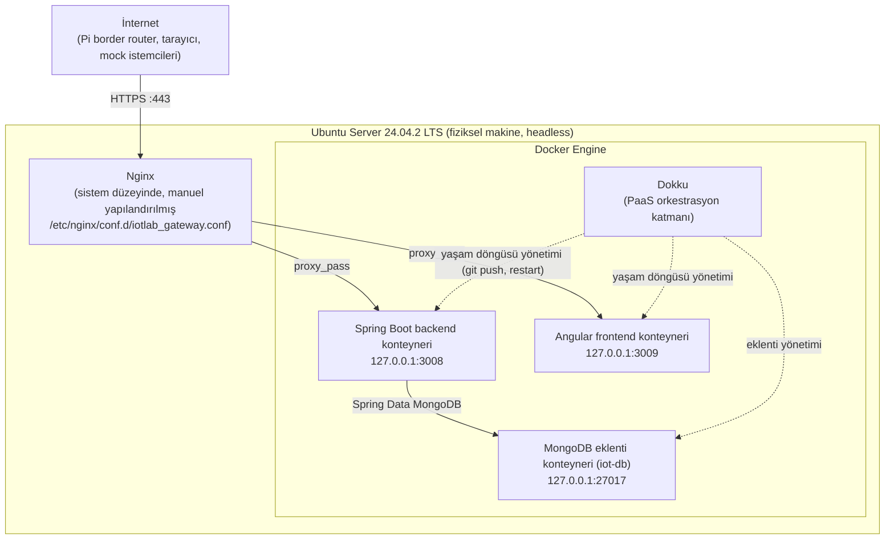

# Sunucu Kurulumu (İşletim Sistemi ve Temel Sistem Yönetimi)

Bu doküman, üniversite tarafından tahsis edilen fiziksel 
makinenin, IoT laboratuvarının tüm servislerini barındıran çalışan bir
ortama dönüştürülme sürecini anlatır.

## Ağ ve Erişilebilirlik

Sunucu üniversitenin iç ağında yer alıyor. Dışarıya açık tek giriş noktası
`443` (HTTPS) portudur. Nginx bu portu dinleyip path'e göre iç
servislere yönlendiriyor. Backend, frontend, MongoDB vb.
Sunucu konteynerlerini  yalnızca yerelde
dinliyor, dışarıdan doğrudan erişilemiyor; dış dünyaya açılan tek yüz
Nginx. Path/port eşlemesinin tam tablosu
[03-system-architecture.md ](03-system-architecture.md)'de.

Alan adı `iotlab.omu.edu.tr` kamuya açık bir üniversite alan adıdır,

## Border Router ile İlişki

Bağlantı yönü tek yönlüdür: Raspberry Pi Zero (border router), sunucuya
HTTPS POST isteği
Sunucu Pi'ye bağlantı açmaz, Pi'yi "arayan" bir mekanizma yoktur.
Bu, sunucu tarafında Pi için özel bir ağ yapılandırması
gerektirmiyor  Pi, sistemin bakış açısından diğer HTTPS
istemcilerinden (tarayıcı, mock veri üretici) farksız bir istemcidir.

## Tasarım Kararları ve Nedenleri

| Karar | Neden |
|---|---|
| Ubuntu Server (LTS) | sistem reboot'u nadiren gerekiyor — "Projemizde IoT cihazlardan gelen verilerin 'sürekli' olarak sunucumuza gelebileceği ve tüm bu verilerin kalıcı olarak depolanabileceği bir altyapı temeli kurulmuştur. Bu bağlamda seçilen işletim sisteminin bu vasfı bizim için 'biçilmez kaftan' olarak nitelendirilmektedir." Ayrıca açık kaynak + Canonical desteğiyle hızlı güvenlik yaması ayrı bir sebeptir.| 
| Dokku (PaaS katmanı) | `git push` ile otomatik deployment, konteyner yaşam döngüsü yönetimi, Nginx/SSL otomasyonunu (kısmen) üstlenerek operasyonel yükü azaltması | 
| Tek sunucuda çok servis çalıştırma (Nginx + Docker Engine + Dokku + N konteyner) | Üniversitenin tahsis ettiği kaynak tek bir fiziksel makineyle sınırlı; ek donanım/bulut maliyeti olmadan tüm sistemi ayağa kaldırma ihtiyacı| 

## İlgili Dokümanlar

- [03-system-architecture.md](03-system-architecture.md) — Uçtan uca mimari, port planı, güven sınırları
- [04-hardware-and-sensors.md](04-hardware-and-sensors.md) — Sunucu donanım envanteri
- [05-border-router.md](05-border-router.md) — Raspberry Pi'nin sunucuyla ilişkisi
- [11-dokku-paas.md](11-dokku-paas.md) — Dokku PaaS
- [12-nginx-gateway.md](12-nginx-gateway.md) — Nginx reverse proxy / gateway

