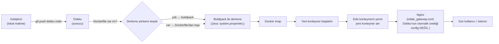

# Dokku PaaS

Bu doküman, uygulamaların (backend, frontend, mock veri üretici) tek
fiziksel Ubuntu sunucu üzerinde nasıl konteynerleştirilip dağıtıldığını
anlatır: Dokku'nun bu projede aldığı rolü, neden bir PaaS katmanı
seçildiğini, dağıtım mekanizmasını ve Dokku'nun MongoDB eklenti
servisini. Nginx'in path bazlı yönlendirme kuralları
[12-nginx-gateway.md](12-nginx-gateway.md)'de, HTTPS/sertifika yönetimi
[13-tls-certificates.md](13-tls-certificates.md)'te ayrıca ele
alınmıştır; burada tekrar edilmez.

## Dağıtım Akışı

## 1. Kapsam ve Dokku'nun Sistemdeki Rolü

Dokku, kurulduğu sunucuyu Heroku benzeri bir "uygulama platformuna"
dönüştüren, açık kaynaklı bir PaaS (Platform as a Service) aracıdır.
Sunucu tarafında Docker Engine'in üzerine oturur; geliştiricinin
`git push` yapması dışında bir işlem yapmasına gerek kalmadan kaynak
kodu bir Docker imajına dönüştürür, konteyneri başlatır ve (varsayılan
olarak) Nginx üzerinden dışarıya açar.

Bu projede Dokku, aşağıdaki sorumlulukları üstleniyor:

- Backend (Spring Boot), frontend (Angular) ve kullanılabilecek herhangi bir uygulamanın her birini ayrı bir konteyner olarak inşa edip çalıştırmak.
- MongoDB'yi bir eklenti (plugin) servisi olarak yönetmek.
- Sunucudaki iç (`127.0.0.1`) portları uygulamalara sabitlemek
  (`ports:add`).

Dokku'nun **kendi ürettiği** Nginx yapılandırması ve SSL sertifika
otomasyonu bu projede fiilen kullanılmıyor bunun yerine elle yazılmış
bir gateway config'i devrededir.

## 2. Neden PaaS? Alternatifler ve Karşılaştırma

> "Dokku, kurulduğu sunucunun adeta "efendisi" olmak isteyen, Herokuya
> açık kaynaklı bir alternatif olarak geliştirilen bir PaaS (Platform
> as a Service) çözümüdür."

> "Dokku, bizim için tüm deployment sürecini otamatikleştirmektedir.
> Dokku tek bir 'git push' işlemiyle uygulamaları tüm bağımlılıkları
> ile birlikte bir docker konteyneri içinde ayağa kaldırabilmektedir.
> Bu, suncuda kullanılabilecek birçok izole servisin yönetimini ve
> bakımını oldukça kolaylaştırmaktadır. Bunun yanında doku karmaşık
> dosya transfer protokolleri veya manuel sunucu yönetimi ve
> konfigürasyonları yerine Git versiyon kontrol sistemini
> kullanmaktadır. Ayrıca, servis ve uygulama kurulumlarının yanı sıra,
> Nginx web sunucusu konfigürasyonlarını ve SSL sertifikası yönetimini
> otomatik olarak yöneterek sistem yöneticisinin iş ağırlığını
> azaltmaktadır."

## 3. Kurulum ve Temel Kavramlar

**Uygulama (app):** Dokku'da her `git push` hedefi bir "app"tir; her
app kendi Docker imajına ve konteynerine sahiptir. 

**Derleme yöntemi — buildpack mi, Dockerfile mı?** Dokku, push edilen
repoda bir `Dockerfile` bulursa imajı ondan inşa eder; yoksa Heroku
kökenli "buildpack" mekanizmasıyla (dil/çatıyı otomatik algılayıp
derler) inşa eder.

**Eklenti (plugin) ve eklenti servisi (service):** Dokku'nun temel
işlevini (app deploy) veritabanı gibi yan servislerle genişleten
mekanizma. Bu projede fiilen kullanılan tek eklenti `dokku-mongo`'dur

**Konteyner yaşam döngüsü:** Her `git push` yeni bir imaj/konteyner
üretir; eskisinin yerini yeni konteyner alır.

## 4. Uygulama Envanteri

| Rol | Ne çalıştırıyor | Host-side port | Nginx path |
|---|---|---|---|
| Backend | Spring Boot, REST API | `127.0.0.1:3008` | `/iot-api/` | 
| Frontend | Angular | `127.0.0.1:3009` | `/iot` |

## 5. Yapılandırma ve Ortam Değişkenleri

Dokku, `dokku config:set <app> KEY=value` ile app başına ortam
değişkeni tanımlar; bu değişkenler konteynere enjekte edilir.

| Değişken adı | application.properties'teki varsayılan | Amaç |
|---|---|---|
| `PORT` | `8080` | Spring Boot'un içeride dinlediği port (`server.port=${PORT:8080}`) — Dokku bunu konteynere enjekte edip host-side portuyla eşliyor. `ports:add`  |
| `MONGO_URL` | `mongodb://localhost:27017/iot-dashboard` | MongoDB bağlantı adresi (`spring.data.mongodb.uri=${MONGO_URL:...}`) |

## 6. Dokku'nun Yetersiz Kaldığı Nokta

> "Sunucunun tasarımın en kritik aşamalarından biri, bir mühendislik
> dokunuşu ile gerçekleştirilmiştir, dış ağlardan *iotlab.omu.edu.tr*
> alan adı üzerinden gelen HTTP/HTTPS isteklerinin karşılanarak ilgili
> servislere doğru bir yol ile yönlendirilmesi süreci oluşturmuştur.
> Dokku aracının, varsayılan Ngix yapılandırmasında yeterli bir Nginx
> otomasyonu sunsa da; sunucunun çoklu servis ve farklı teknolojileri
> aynı makine üzerinde barındırma gereksinimleri, bu otomasyonun
> sınırlarının dışına çıkılmasını zorunlu hale getirmiştir. Bu
> bağlamda, Dokku'nun standart olarak sunduğu Nginx yönlendirme
> kuralları geçersiz kılınarak, sunucuya özel bir Ters Vekil Sunucu
> mimarisi manuel olarak inşa edilmiştir."

## İlgili Dokümanlar

- [03-system-architecture.md](03-system-architecture.md) — Uçtan uca mimari, bileşen envanteri, port planı (otoriter kaynak)
- [10-server-setup.md](10-server-setup.md) — Ubuntu sunucu kurulumu, Dokku'nun çalıştığı ortam
- [12-nginx-gateway.md](12-nginx-gateway.md) — Nginx reverse proxy / gateway (§9'un çözümü)
- [08-data-model.md](08-data-model.md) — MongoDB koleksiyonları (`iot-db` içeriği)
