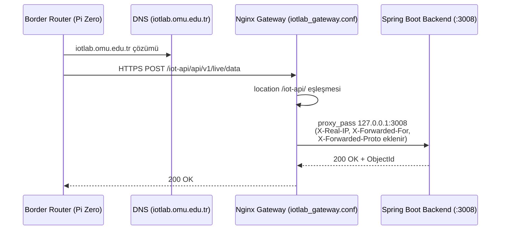
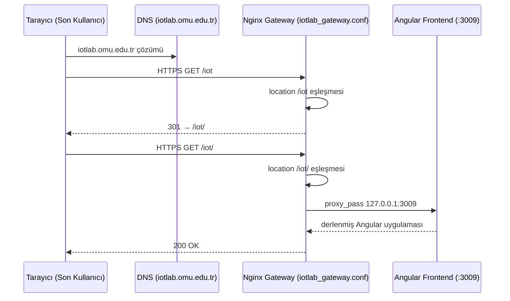

# Nginx Gateway (Ters Vekil)

Bu doküman, `iotlab.omu.edu.tr` alan adı altında birden çok bağımsız
uygulamayı (backend, frontend vb) farklı path'lerde
tek bir Nginx yapılandırmasıyla yayınlayan gateway katmanını anlatır.

## 1. Problem Tanımı

Dokku'nun varsayılan Nginx
otomasyonu, her uygulamayı kendi alt alan adında veya kendi domain'inde
yayınlamak üzere tasarlanmıştır — "bir app = bir vhost" modeli. Bu
projenin ihtiyacı farklıydı: tek bir alan adı altında, farklı
path'lerde, farklı teknolojide birden fazla uygulamayı aynı anda
yayınlamak.

Bu iki model arasındaki uyumsuzluk yalnızca bir tercih meselesi
değildi, somut bir kısıttan doğuyordu: alan adı tahsisi
(`iotlab.omu.edu.tr`) üniversite ağında kurum düzeyinde yapılan bir
işlemdir
Dokku'nun "app = subdomain" modelini olduğu gibi kullanmak, her yeni
uygulama için (`backend.iotlab.omu.edu.tr`, `mock.iotlab.omu.edu.tr`
gibi) ayrı bir alt alan adı DNS kaydı talep etmeyi gerektirirdi  bu,
projenin kurum BT süreçleriyle tekrar
tekrar etkileşmesi anlamına gelirdi ve pratik değildi. Path bazlı
yönlendirme ise tek bir DNS kaydıyla (zaten var olan
`iotlab.omu.edu.tr`) sınırsız sayıda uygulamayı sunucumuzda barındırabiliyoruz.


## 2. Çözüm Yaklaşımı

Dokku'nun kendi ürettiği Nginx yapılandırması ve SSL otomasyonu bu
projede fiilen kullanılmıyor; bunun yerine elle yazılmış, tek bir
gateway yapılandırması devrede: `/etc/nginx/conf.d/iotlab_gateway.conf`


## 3. Yönlendirme Haritası

| Path | Hedef Port | Dokku Uygulaması | Ne Sunduğu |
|---|---|---|---|
| `/iot-api/` | `127.0.0.1:3008` | Spring Boot backend (`iot-dashboard`) | REST API, JWT auth, iş mantığı | 
| `/iot` | `127.0.0.1:3009` | Angular frontend | Dashboard/History/NodeDetail arayüzü | 
| `/` (varsayılan) | `127.0.0.1:3001` | Okul Sayfası | IoT Lab Bilgilendirme Sayfası | 

Gerçek Dokku uygulama isimleri (`dokku apps:list` çıktısı) hiçbir
kaynakta yok; tablodaki "Dokku Uygulaması" sütunu bu yüzden rol
adlarıyla dolduruldu, gerçek slug'lar bilinmiyor
([11-dokku-paas.md §4](11-dokku-paas.md#4-uygulama-envanteri)).
`/` → 3001 satırının bu projeye mi yoksa sunucudaki başka bir
çalışmaya mı ait olduğu da doğrulanmamıştır — CLAUDE.md kural 9
gereği bu, kesin bir bileşen gibi sunulmuyor.


## 4. Yapılandırmanın Anatomisi

Yazdığımız gateway konfigürasyonu, dış dünyadan gelen trafiği alıp içerideki mikro servislere (Docker/Dokku konteynerlerine) güvenli ve izole bir şekilde dağıtan ana omurgayı oluşturuyor. Dosyanın teknik iskeleti şu dört ana kısımdan oluşuyor:

* **Server Bloğu ve HTTPS Sınırı:** Sunucumuz dışarıya yalnızca 443 (HTTPS) portundan açık. Tüm istekler ana `server {}` bloğu içinde karşılanıyor. Tek noktada TLS/SSL sonlandırması yaptığımız için arkadaki Spring Boot veya Angular uygulamalarının güvenlik sertifikalarıyla uğraşmasına gerek kalmıyor; onlar sadece kendi iş mantıklarına odaklanıyor.
* **Location Blokları (Path Bazlı Yönlendirme):** Dokku'nun varsayılan "her uygulama için bir alt alan adı" dayatmasını burada eziyoruz. Nginx, gelen trafiğin path'ine bakıyor. Trafik `/iot-api` veya `/iot` gibi uçlara geldiğinde, öncelikle bir 301 yönlendirmesiyle sonlarına eğik çizgi ekleyerek (`/iot-api/`, `/iot/`) path yapısını standartlaştırıyor. `/` lokasyonu ise diğer hiçbir kurala uymayan istekleri yakalayan varsayılan ağ olarak (catch-all) Okul Sayfasına yönlendiriyor.
* **Ters Vekil (Reverse Proxy) Hedefleri:** Trafik standartlaştırıldıktan sonra, izole network'te koşan uygulamalarımıza `proxy_pass` ile aktarılıyor. Spring Boot backend'imiz `127.0.0.1:3008`, Angular frontend'imiz `127.0.0.1:3009`, varsayılan sayfamız ise `127.0.0.1:3001` üzerinde dinliyor. Konteyner portlarının hiçbiri doğrudan internete açık değil; gateway burada sağlam bir güvenlik duvarı işlevi görüyor.
* **Orijinal İstemci Üstbilgileri (Headers):** Bütün trafik Nginx üzerinden geçtiği için, arkadaki uygulamalar kaynağı hep `127.0.0.1` olarak görür. Gerçek cihaz IP'lerini loglarda görebilmek ve işleyebilmek adına `X-Real-IP`, `X-Forwarded-For` ve `X-Forwarded-Proto` header'larını proxy_pass aşamasında isteklere gömerek arkaya taşıyoruz.

### Ek: iotlab_gateway.conf

```nginx
# HTTP'den HTTPS'e zorunlu yönlendirme (80 portuna gelenleri 443'e atar)
server {
    listen 80;
    server_name iotlab.omu.edu.tr;
    return 301 https://$host$request_uri;
}

# Asıl Gateway Bloğu
server {
    listen 443 ssl http2;
    server_name iotlab.omu.edu.tr;

    # SSL Sertifikaları 
    ssl_certificate /etc/nginx/ssl/iotlab.omu.edu.tr.crt;
    ssl_certificate_key /etc/nginx/ssl/iotlab.omu.edu.tr.key;

    # Güvenlik ve Şifreleme Ayarları
    ssl_protocols TLSv1.2 TLSv1.3;
    ssl_prefer_server_ciphers on;

    # Gerçek cihaz IP'sini ve protokolünü arkadaki servislere taşıma
    proxy_set_header Host $host;
    proxy_set_header X-Real-IP $remote_addr;
    proxy_set_header X-Forwarded-For $proxy_add_x_forwarded_for;
    proxy_set_header X-Forwarded-Proto $scheme;

    # ========================================== #
    # PATH BAZLI YÖNLENDİRME (LOCATION BLOCKS)   #
    # ========================================== #

    # 1. Rota: Spring Boot Backend (REST API)
    # Eğer istek sadece /iot-api olarak gelirse, sonuna slash ekleyerek 301 fırlat
    location = /iot-api {
        return 301 /iot-api/;
    }
    
    # Doğru formatlı istekleri backend konteynerine (Port 3008) ilet
    location /iot-api/ {
        proxy_pass [http://127.0.0.1:3008](http://127.0.0.1:3008);
    }

    # 2. Rota: Angular Frontend (Dashboard)
    # Eğer istek sadece /iot olarak gelirse, sonuna slash ekleyerek 301 fırlat
    location = /iot {
        return 301 /iot/;
    }

    # Doğru formatlı istekleri frontend konteynerine (Port 3009) ilet
    location /iot/ {
        proxy_pass [http://127.0.0.1:3009](http://127.0.0.1:3009);
        # Angular dev-server veya websocket akışları için gerekli headerlar
        proxy_http_version 1.1;
        proxy_set_header Upgrade $http_upgrade;
        proxy_set_header Connection "upgrade";
    }

    # 3. Rota: Okul Sayfası (Varsayılan Kök Dizin)
    # Üstteki kurallara uymayan her şey (örneğin ana domain) 3001'e gider
    location / {
        proxy_pass [http://127.0.0.1:3001](http://127.0.0.1:3001);
    }
}
```


## 6. İstek Akışı






## 7. Ters Vekilin Sağladığı Diğer Kazanımlar

Bu proje bağlamında doğrudan kanıtlanmış iki kazanım var:

- **İç servislerin doğrudan dışa açılmaması.** Backend, frontend ve MongoDB konteynerlerinin hepsi yalnızca
  `127.0.0.1` üzerinde dinliyor; dışarıya açılan tek yüz nginx'tir
  Gateway olmasaydı bu izolasyonu sağlamak için her uygulamanın
  kendi TLS/erişim kontrolünü ayrı ayrı yönetmesi gerekirdi.
- **Tek TLS sonlandırma noktası.** Konteynerlerin her biri
  kendi sertifikasını yönetmek yerine, TLS tek bir yerde
  sonlandırılıyor


## İlgili Dokümanlar

- [03-system-architecture.md](03-system-architecture.md) — Uçtan uca mimari, ağ topolojisi ve port planı (otoriter kaynak)
- [10-server-setup.md](10-server-setup.md) — Ubuntu sunucu kurulumu, ağ ve erişilebilirlik
- [11-dokku-paas.md](11-dokku-paas.md) — Dokku PaaS, bu dokümanın çözdüğü sorunun teşhisi (§9)

